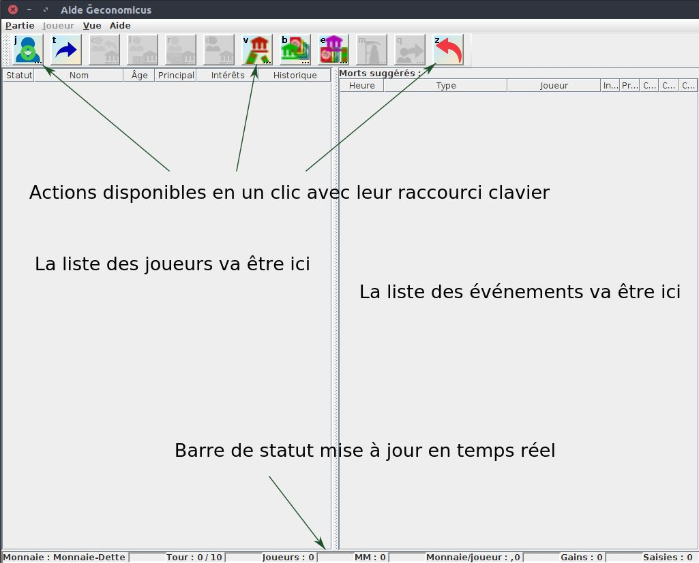
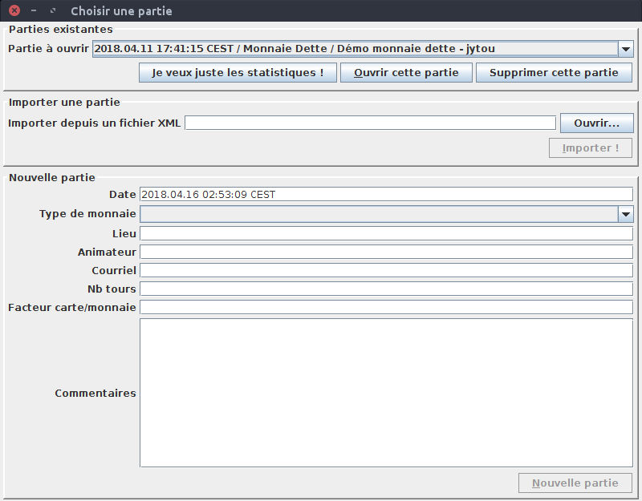
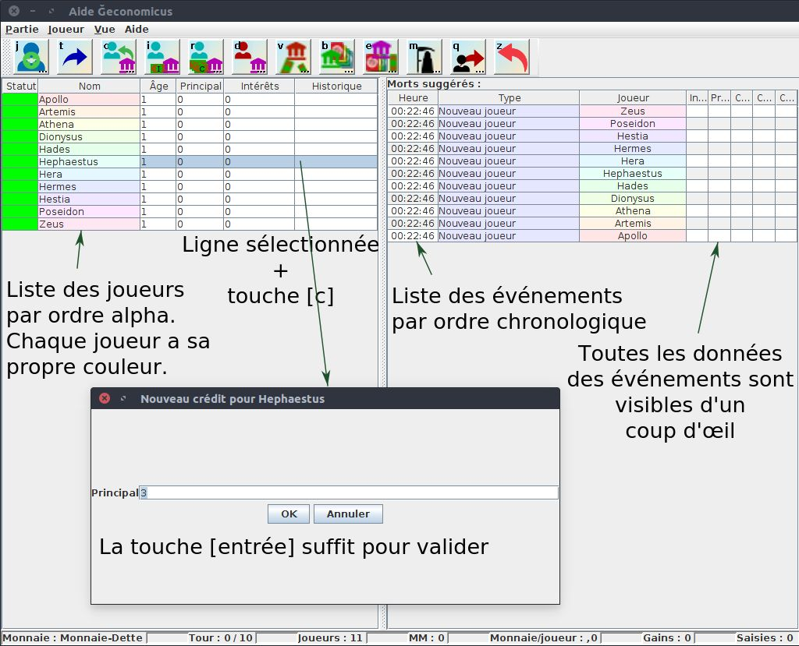
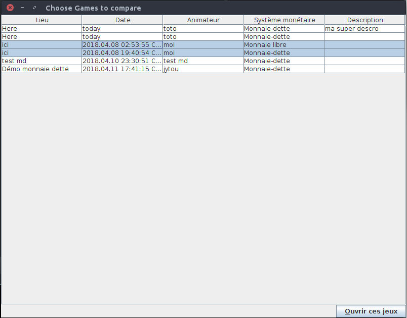
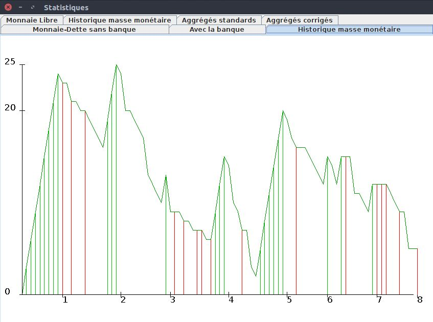
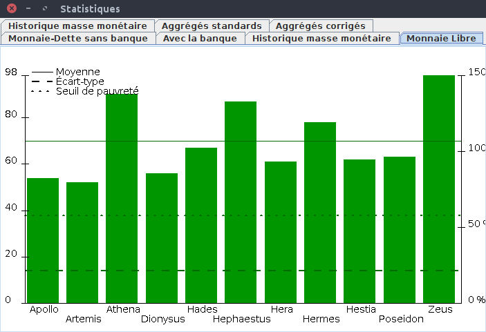

# Le jeu Ğeconomicus et ses règles

## Le concept en une phrase

Ğeconomicus est un jeu de société pédagogique qui fait vivre à ses joueurs, en
quelques dizaines de minutes, l'équivalent d'une vie économique entière (environ
80 ans), une fois avec un système de **monnaie dette** (comme la monnaie qui domine
aujourd'hui la plupart des économies), une fois avec un système de **monnaie libre**
(fondé sur la Théorie Relative de la Monnaie), afin de pouvoir **comparer concrètement**
les effets de chacun sur les échanges et les inégalités entre joueurs.

Ce document résume le principe du jeu pour qu'un nouvel animateur ou un joueur
curieux comprenne rapidement de quoi il s'agit. **Il ne remplace pas les règles
officielles complètes**, disponibles ici :

- 📖 **Règles officielles du jeu** : https://geconomicus.glibre.org/rules.html
- 📖 **Théorie Relative de la Monnaie (TRM)**, qui fonde les règles de la monnaie libre
  utilisée dans le jeu : https://trm.creationmonetaire.info/

## Déroulement d'une partie

1. **Des cartes valeurs** représentent des biens/services (matières premières,
   matières intellectuelles, etc.), que les joueurs échangent entre eux contre
   **des jetons** représentant l'unité monétaire de la partie.
2. La partie se déroule en **tours** de quelques minutes chacun. Un tour représente
   une tranche de la vie économique d'un joueur.
3. À chaque tour, **un ou plusieurs joueurs "meurent" aléatoirement** : ils ne
   peuvent plus échanger pendant ce tour. Au tour suivant, ils **renaissent**, en
   repartant à zéro en termes de richesse accumulée — comme un nouvel individu qui
   entre dans l'économie.
4. **Tous les échanges et événements sont enregistrés en temps réel** par
   l'animateur/banquier sur informatique (c'est le rôle de cet outil), afin de
   pouvoir ensuite reconstituer et comparer objectivement ce qui s'est passé.
5. En fin de partie, on compare les données de la partie "monnaie dette" et de la
   partie "monnaie libre" — idéalement jouées avec les mêmes joueurs — à l'aide de
   **courbes et d'histogrammes** montrant la répartition des richesses, les
   inégalités générées, etc.

## Les deux systèmes monétaires comparés

### Monnaie dette

C'est **la banque** (incarnée par un joueur ou l'animateur) qui crée la monnaie, en
l'octroyant sous forme de **crédits** que les emprunteurs doivent ensuite rembourser
**avec intérêts**. C'est le fonctionnement dominant des systèmes monétaires actuels
dans la plupart des économies contemporaines.

### Monnaie libre

La monnaie est créée symétriquement par chaque participant selon les règles de la
**Théorie Relative de la Monnaie (TRM)** de Stéphane Laborde : chaque joueur reçoit
un **Dividende Universel** régulier, sans dette ni intérêt à rembourser. C'est le
principe derrière la monnaie **June (Ğ1)**.

L'objectif du jeu est de rendre **sensible et mesurable**, plutôt que théorique, la
différence de dynamique entre ces deux systèmes (répartition des richesses, rythme
des échanges, effet du "vieillissement" économique des joueurs, etc.).

## Origine de cet outil

Cet outil d'aide à l'animation (saisie des échanges, calcul automatique de la
monnaie libre selon la TRM, statistiques de fin de partie) s'inspire directement du
travail original de **jytou**, disponible ici :

🔗 **https://gitlab.com/jytou/geconomicus_helper**

La présente version reprend l'intégralité de la logique métier de jytou (calculs de
la monnaie dette et de la monnaie libre, gestion des tours et des morts/renaissances)
et la fait évoluer techniquement (voir `03-architecture-technique.md`) tout en
préservant scrupuleusement les règles du jeu telles que définies dans le projet
original.

## Les écrans historiques (interface Swing, héritée du projet de jytou)

L'application desktop (module `geco-app` de ce projet) reprend l'interface visuelle
du logiciel original. Ces captures — issues du dépôt de jytou — restent
représentatives de l'interface actuelle après migration technique (voir
`02-installation.md` pour la lancer).

### Écran principal en cours de partie

L'animateur/banquier y voit en permanence : la liste des joueurs (avec leur statut,
dette, intérêts), le journal des événements dans l'ordre chronologique inverse, des
boutons d'action rapide avec raccourcis clavier (un remboursement d'intérêt se fait
en une touche), et une barre de statut en temps réel (masse monétaire, nombre de
tours, nombre de joueurs...).

### Choisir ou créer une partie

Au lancement, l'animateur choisit une partie existante (sauvegardée automatiquement
en base de données locale) ou en crée une nouvelle.

### Nouveau crédit (monnaie dette)

Enregistrement d'un crédit accordé par la banque à un joueur, avec un montant
principal et un taux d'intérêt.

### Comparer plusieurs parties

C'est cette vue qui permet de sélectionner deux (ou plusieurs) parties — typiquement
une en monnaie dette et une en monnaie libre, jouées avec les mêmes joueurs — pour en
comparer les statistiques.

### Statistiques de fin de partie

Ces écrans affichent les courbes et histogrammes de répartition des richesses en fin
de partie, pour chacun des deux systèmes monétaires, et permettent une comparaison
visuelle directe de leurs effets sur les inégalités entre joueurs.

## Aller plus loin

- Règles officielles complètes et variantes : https://geconomicus.glibre.org/rules.html
- Théorie Relative de la Monnaie (TRM) : https://trm.creationmonetaire.info/
- Projet original de l'outil d'animation : https://gitlab.com/jytou/geconomicus_helper
