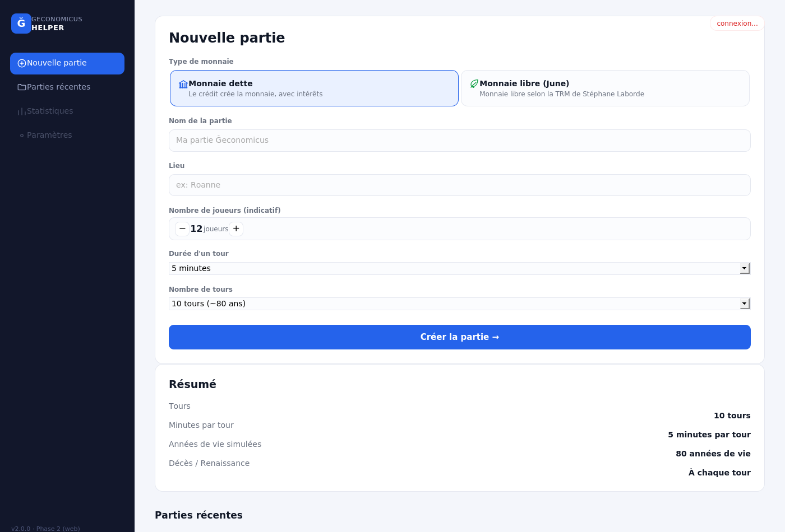
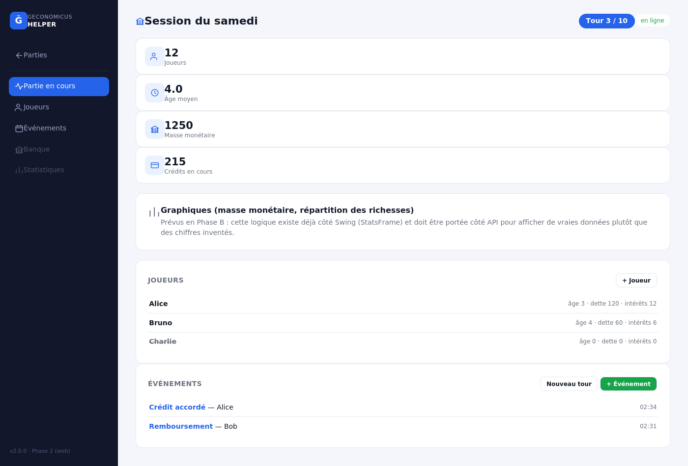
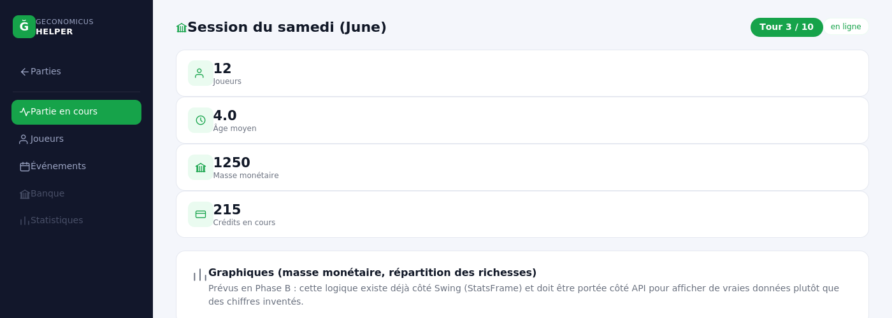

# Architecture technique et choix effectués

Ce document explique, pour toute personne souhaitant comprendre ou contribuer au
code, **ce qui a été fait** et **pourquoi**, depuis le projet original de jytou
(https://gitlab.com/jytou/geconomicus_helper) jusqu'à l'état actuel.

## Vue d'ensemble du projet

Le projet évolue en 3 grandes étapes :

1. **Étape 1 — Modernisation technique minimale** : faire tourner le code existant
   (Java 8, Swing) sur une version récente de Java, sans changer une seule ligne de
   logique métier. *(terminée)*
2. **Étape 2 — Interface moderne, web** : remplacer l'interface Swing par une
   interface HTML5/CSS3/JS moderne et responsive, servie par un petit serveur local.
   *(en cours)*
3. **Étape 3 — Jeu "sans matériel"** : permettre de jouer uniquement avec des
   smartphones (scan d'un QR code affiché par l'ordinateur de l'animateur, pas de
   cartes ni jetons physiques), fonctionnement 100% local (Wi-Fi ou Bluetooth),
   installation simplifiée via Docker. *(à venir)*

## Étape 1 : migration Java 8 → Java 21

### Constat de départ

Le projet original de jytou était un projet Eclipse classique (pas d'outil de build
comme Maven), ciblant Java 8, utilisant Swing pour l'interface, JPA 2.1
(EclipseLink) + H2 pour la persistance, et JAXB pour l'export/import XML.

### Pourquoi Java 21 ?

Java 21 est la version **LTS** (Long Term Support) la plus récente au moment de la
migration : elle bénéficie d'un support long terme par la communauté/Oracle, contrairement
aux versions intermédiaires (non-LTS) qui cessent rapidement d'être maintenues. C'est
le choix le plus pérenne pour un projet destiné à durer.

### Le vrai point de blocage : JAXB

Passer de Java 8 à Java 21 n'est pas qu'un changement de numéro de version : **le
module JAXB (`javax.xml.bind`, utilisé pour l'export/import XML des parties) a été
retiré du JDK depuis Java 11**. C'était le seul point de blocage réel identifié dans
tout le code (environ 6000 lignes) : tout le reste (Swing, le moteur métier)
compile sans modification sous Java 21.

### Ce qui a été fait

- **Migration vers Jakarta EE** : `javax.persistence` → `jakarta.persistence` (JPA
  2.1 → Jakarta Persistence 3.1, EclipseLink 2.7.1 → 4.0.4) et `javax.xml.bind` →
  `jakarta.xml.bind` (Jakarta XML Binding 4.0.2). Il s'agit du même standard, sous sa
  nouvelle gouvernance (Eclipse Foundation) : le renommage de package est mécanique,
  aucune logique n'a changé. C'est le choix le plus pérenne, `javax.*` étant en fin
  de vie dans l'écosystème.
- **H2** mis à jour de 1.4.197 à 2.2.224 (base de données embarquée, changement de
  version sans impact sur le code applicatif).
- **Introduction de Maven** : le projet ne disposait d'aucun outil de build. Un
  `pom.xml` a été mis en place pour gérer les dépendances et automatiser la
  compilation/l'empaquetage — un prérequis pour toute intégration future dans un
  pipeline Docker (étape 3).
- Quelques API dépréciées corrigées au passage (`new Integer(0)` →
  `Integer.valueOf(0)`, `new URL(String)` → `URI.create(String)`).

## Étape 2 : vers une interface web moderne

### Le choix structurant : ne pas repartir de zéro à l'étape 3

Plutôt que de moderniser l'apparence de Swing (étape 2) pour ensuite tout jeter et
réécrire en Node.js pour le web (étape 3), le choix a été fait de considérer
**l'étape 2 comme le début technique de l'étape 3** : le code HTML/CSS/JS et l'API
écrits maintenant seront directement réutilisés, pas remplacés.

### Découpage en 3 modules Maven

| Module | Rôle | Dépend de |
|---|---|---|
| `geco-engine` | Moteur métier pur : entités `Game`/`Player`/`Event`, calculs monnaie dette/monnaie libre, persistance JPA/H2. Aucune dépendance UI. | — |
| `geco-app` | Interface Swing historique + CLI (étape 1). | `geco-engine` |
| `geco-server` | Serveur web local (Javalin) : API REST + WebSocket, sert le front HTML/CSS/JS (étape 2 → 3). | `geco-engine` |

Ce découpage garantit que **la logique métier (calculs TRM, monnaie dette, gestion
des tours et des morts/renaissances) ne dépend d'aucun choix d'interface** : elle
est écrite une seule fois dans `geco-engine`, et partagée à l'identique par
l'interface bureau et l'interface web. Aucun risque de "double calcul" ou de
divergence entre les deux interfaces.

### Pourquoi Javalin plutôt que Node.js pour le serveur ?

Un serveur web dédié était nécessaire pour servir l'interface HTML/CSS/JS et exposer
une API. Le choix s'est porté sur **Javalin** (bibliothèque Java légère, construite
sur Jetty) plutôt que sur une réécriture en Node.js, pour plusieurs raisons :

- **Aucune réécriture de la logique métier** : `geco-engine` (Java) est réutilisé tel
  quel. Réécrire les calculs économiques dans un autre langage aurait introduit un
  risque réel de divergence/bug dans une logique qui doit rester rigoureusement
  exacte.
- **Simplicité de déploiement** : un seul jar exécutable, pas de runtime Node.js
  séparé à installer côté animateur.
- **Java moderne (21) gère très bien le temps réel multi-clients** nécessaire pour
  l'étape 3 (threads virtuels, WebSocket natif via Javalin/Jetty).
- Node.js n'est pas exclu pour la suite : il pourra être introduit ponctuellement
  pour un composant précis où son écosystème apporte un vrai bénéfice (par exemple
  la génération de QR codes à l'étape 3), sans nécessiter de réécrire le moteur.

### Architecture du serveur

```
Navigateur (HTML/CSS/JS)
        │  HTTP (REST) + WebSocket
        ▼
  geco-server (Javalin)
        │  appels directs (même JVM)
        ▼
   geco-engine (JPA/H2)
```

- **API REST** (`/api/games`, `/api/games/{id}/players`, `/api/games/{id}/events`,
  etc.) pour les actions ponctuelles (créer une partie, ajouter un joueur,
  enregistrer un événement).
- **WebSocket** (`/ws`) pour diffuser en temps réel les changements à tous les
  clients connectés. C'est ce mécanisme qui, à l'étape 3, permettra de synchroniser
  plusieurs smartphones sans changement d'architecture : il suffira que chaque
  téléphone se connecte au même canal.
- **DTO (Data Transfer Objects)** plutôt que sérialisation directe des entités JPA :
  les entités `Game`/`Player`/`Event` ont des références croisées (`Game` contient
  ses `Player`, chaque `Player` référence son `Game`) qui produiraient une boucle
  infinie en JSON. Les DTO (`Dtos.java`) ne gardent que les champs utiles à
  l'affichage, dans un seul sens.

### Choix du front : HTML/CSS/JS natif, sans framework ni build tool

Le premier front (module `geco-server/src/main/resources/public`) est écrit en
JavaScript natif (pas de React/Vue), sans étape de build (pas de Webpack/Vite). Ce
choix reprend l'esprit de simplicité du projet original de jytou : lancer
l'application ne nécessite qu'un jar et un navigateur, aucune chaîne d'outils
supplémentaire à installer ou maintenir. Si l'interface web se complexifie fortement
par la suite, l'introduction d'un framework pourra être reconsidérée.

**Aperçu du nouveau front (Phase A — refonte visuelle selon la maquette fournie) :**







Le thème (bleu/vert, logo, badges) bascule automatiquement selon le système
monétaire de la partie ouverte (`document.body.classList.toggle("money-libre", ...)`
dans `app.js`), sans dupliquer les styles.

### Phase A : ce qui est fait, ce qui est volontairement différé

**Fait et fonctionnel :**
- Refonte visuelle complète (sidebar sombre, cartes de contenu claires, thème
  dynamique dette/libre) fidèle à la maquette fournie.
- Écran "Nouvelle partie" : sélection du type de monnaie, formulaire complet,
  résumé calculé en direct.
- Tableau de bord de partie avec **cartes statistiques calculées à partir de
  vraies données** : nombre de joueurs actifs, masse monétaire, crédits en
  cours (déjà exposés par le moteur), et un nouveau calcul d'**âge moyen** (en
  tours écoulés depuis la dernière naissance/renaissance de chaque joueur,
  calculé en rejouant l'historique des événements côté serveur — voir
  `Dtos.GameDetailDto`).
- Liste des joueurs et des événements, création d'événements (inchangé depuis la
  correction précédente).

**Volontairement laissé en placeholder à l'époque, désormais fait en Phase B (voir
ci-dessous) :** les graphiques de masse monétaire et de répartition des richesses.

**Reste en placeholder :**
- Le minuteur de tour, la séquence de fin de tour (décès/naissances), l'onglet
  Banque et l'écran de statistiques de fin de partie : prévus aux Phases C/D.

### Phase B : graphiques réels (masse monétaire, répartition des richesses)

Portage fidèle de la logique déjà utilisée par `StatsFrame.java` côté Swing (classes
`HistoryStats` et `computeValues`/`addFromEvent`, environ 600 lignes), plutôt qu'une
réécriture : le nouveau `StatsService.java` (module `geco-server`) réutilise
directement `Game.recomputeAll()` — une méthode du moteur déjà prévue pour cet usage
("*Very useful to make historical graphs*", cf. sa Javadoc) — pour rejouer
l'historique complet des événements et reconstituer :

- **la masse monétaire à la fin de chaque tour** (courbe), en capturant
  `Game.getMoneyMass()` à chaque événement `TURN` rencontré ;
- **la richesse accumulée par chaque joueur** (répartition Top 20% / 20-80% /
  Bottom 20%), en portant l'algorithme `addFromEvent` : chaque événement crédite (ou
  débite) un montant au joueur concerné selon son type (crédit, remboursement, mort,
  rupture technologique qui double le facteur de valeur des cartes, etc.).

Nouvelle route `GET /api/games/{id}/stats`, consommée par le front via **Chart.js**
(chargé en CDN, cohérent avec le choix "pas de build tool" du projet) : un graphique
en ligne pour la masse monétaire, un anneau pour la répartition des richesses, avec
une légende détaillée. Les couleurs suivent le thème dynamique dette/libre déjà en
place depuis la Phase A.

**Différence assumée avec la version Swing :** le calcul de répartition des
richesses se limite ici aux joueurs (sans inclure la banque), pour correspondre au
graphique de la maquette qui est centré sur les joueurs ; la version Swing propose
en plus une option pour inclure la banque dans ses propres statistiques agrégées.

**Point de vigilance non vérifiable dans mon environnement de préparation** :
Chart.js n'a pas pu être testé visuellement ici — mon outil de capture d'écran
utilise un moteur JavaScript ancien (QtWebKit, via `wkhtmltoimage`) qui échoue même à
*interpréter* le bundle Chart.js minifié (`SyntaxError` sur une simple déclaration
`let`), bien avant tout problème de rendu. Ce n'est pas un problème dans un vrai
navigateur (Chrome, Firefox, Safari, Edge supportent tous Chart.js sans problème),
mais je n'ai donc pas pu produire de capture d'écran réelle des graphiques pour
cette phase, contrairement aux écrans de la Phase A. Le code Java a été validé par
compilation ; le code JS par vérification de syntaxe (`node -c`) et relecture
attentive de l'API Chart.js v4 (documentée officiellement). **Merci de confirmer
visuellement une fois `mvn clean package` puis `java -jar geco-server/target/geco-server.jar`
lancés chez vous.**

### Phase C : minuteur de tour synchronisé + séquence de fin de tour

**Minuteur synchronisé entre plusieurs clients.** Plutôt que de faire tourner un
décompte indépendant dans chaque navigateur (qui dériverait inévitablement d'un
client à l'autre au bout de quelques minutes), le serveur retient deux informations
sur chaque partie : `turnDurationSeconds` (durée d'un tour, réglée à la création) et
`turnStartedAt` (horodatage de début du tour en cours). Chaque client calcule alors
localement le temps restant par simple différence avec l'heure actuelle. Ces deux
champs ont été ajoutés à l'entité `Game` (`geco-engine`), avec une valeur par défaut
(300 s) pour rester compatible avec les parties créées avant cet ajout et avec l'app
Swing, qui ne les renseigne pas.

- `turnStartedAt` est réinitialisé automatiquement à chaque nouvel événement `TURN`.
- Nouvelle route `POST /api/games/{id}/turn/extend?seconds=30` (bouton "+30s") :
  recule `turnStartedAt`, ce qui allonge le temps restant pour **tous** les clients
  connectés sans état supplémentaire à synchroniser.
- Le bouton "Pause" du minuteur, en revanche, est **volontairement local à chaque
  navigateur** (il ne fait qu'arrêter la mise à jour visuelle côté client) : une
  vraie pause partagée par tous les écrans demanderait de stocker un état "en pause"
  côté serveur, hors du périmètre de cette phase.

**Séquence de fin de tour**, fidèle à la maquette (résumé → décès → nouveaux-nés →
préparation) : le bouton "Nouveau tour" n'enregistre plus directement l'événement,
il ouvre un assistant à 4 étapes qui :
1. résume le tour qui se termine (événements enregistrés, crédits accordés,
   intérêts prélevés, remboursements, masse monétaire) à partir des événements déjà
   chargés côté client ;
2. laisse l'animateur sélectionner le(s) joueur(s) qui meurent ce tour ;
3. rappelle qui vient de "renaître" ;
4. affiche une checklist de préparation, puis déclenche réellement le nouveau tour
   (événements `DEATH` pour les joueurs sélectionnés, puis `TURN`).

**Différence assumée avec les règles officielles du jeu** : la notice officielle
prévoit que l'ordre des décès est **tiré au sort et fixé secrètement dès le début de
la partie** ("*Seul l'animateur connaît à l'avance le nom du ou des défunts de
chaque tour*"). Cette version ne fait pas encore ce tirage au sort à la création :
l'animateur choisit manuellement qui meurt à chaque tour, comme le fait déjà
l'application Swing existante aujourd'hui. Ajouter un vrai tirage au sort
pré-assigné (avec révélation progressive plutôt que sélection libre) est une
amélioration possible d'une phase ultérieure, mais représente un changement de
mécanique de jeu qu'il valait mieux ne pas décider unilatéralement.

### Phase D : écran de fin de partie et rapport statistique

Nouvelle route `GET /api/games/{id}/report`, accessible depuis l'entrée
"Statistiques" du menu (désormais activée). Les indicateurs affichés reprennent
explicitement ceux demandés par la notice officielle du jeu (section
["Compte rendu"](https://geconomicus.glibre.org/rules.html#compte-rendu)) :

- le nombre total de valeurs produites par joueur (agrégé en "Production totale"),
- la moyenne globale des valeurs produites,
- l'écart type de production,
- complétés par la médiane et un **indice de Gini** (mesure standard d'inégalité,
  0 = égalité parfaite, 100 = inégalité maximale), formule validée numériquement sur
  des cas de référence avant intégration (égalité parfaite → 0, cas d'inégalité
  extrême à 4 joueurs → 0,75, cf. tests manuels effectués pendant le développement).

Un histogramme (graphique en barres, Chart.js) répartit les joueurs par tranches de
richesse finale ; ces tranches sont calculées dynamiquement à partir de l'étendue
réelle des valeurs de la partie plutôt que des seuils fixes, pour rester pertinentes
quelle que soit l'échelle de jeu. La courbe de masse monétaire réutilise le calcul
déjà fait en Phase B.

**Point d'attention important, documenté explicitement dans l'interface** : la
richesse d'un joueur n'est comptabilisée qu'au moment de son événement "Mort /
Renaissance" ou "Fin de partie" - c'est le principe même du tableur original ("*tous
les joueurs sont appelés un par un devant l'animateur*" en fin de partie). Si des
joueurs sont encore actifs au moment de consulter le rapport, un bandeau
d'avertissement l'indique clairement plutôt que d'afficher un total silencieusement
incomplet.

**Export réel** : le bouton "Exporter le rapport" télécharge un fichier JSON
contenant toutes les données du rapport - fonctionnel dès maintenant, pas une simple
maquette. Un export plus élaboré (PDF, ou format compatible avec les tableurs
LibreOffice mentionnés dans la notice officielle) pourra être envisagé plus tard si
le besoin s'en fait sentir.

**Non fait dans cette phase** : la comparaison visuelle entre deux parties (par
exemple monnaie dette vs monnaie libre jouées par les mêmes joueurs), visible sur la
maquette sous forme d'une courbe à deux couleurs. Cela suppose de savoir associer
deux parties entre elles, ce qui n'existe pas encore dans le modèle de données -
prévu comme amélioration possible d'une phase ultérieure plutôt que d'être ajouté
au forceps ici.

### Correctif : graphiques qui ne s'affichaient pas (zones blanches)

Remonté après un premier test réel. Cause identifiée : les `<canvas>` des
graphiques (Phases B et D) étaient configurés avec `maintainAspectRatio: false`
(pour occuper toute la largeur disponible) mais placés directement dans des cartes
sans conteneur parent à **hauteur CSS explicite**. C'est un piège classique et bien
documenté de Chart.js : sans hauteur définie sur le conteneur, le canvas reste à
hauteur nulle et le graphique n'apparaît jamais, sans la moindre erreur JavaScript
visible dans la console — d'où le symptôme "zone blanche silencieuse".

**Corrigé** : chaque `<canvas>` est désormais enveloppé dans une `<div
class="chart-container">` avec une hauteur fixe en CSS (220px, ou 140×140px pour
l'anneau de répartition des richesses), conformément au pattern documenté par
Chart.js pour les conteneurs responsives.

En complément, une garde défensive a été ajoutée côté JS (`typeof Chart ===
"undefined"`) : si jamais la bibliothèque ne se charge pas (connexion internet
absente, blocage réseau de `cdnjs.cloudflare.com`...), un message explicite
s'affiche à la place d'une zone vide incompréhensible.

### Assistant tutoriel (infobulles guidées), conçu pour être détachable

Nouveau fichier `js/tutorial.js`, ajouté à la demande explicite d'un module
**totalement autonome et retirable en une seule modification** : la suppression
d'une unique ligne (`<script src="/js/tutorial.js">`) dans `index.html` désactive
complètement la fonctionnalité, sans toucher à aucun autre fichier.

Choix d'implémentation qui permettent cette séparation stricte :
- Le fichier cible les éléments à mettre en avant via les **ID déjà existants**
  dans `index.html` (`#btnNewGame`, `#turnTimer`, `#navStats`...) : aucun attribut
  `data-*` supplémentaire n'a été ajouté au HTML pour ce module.
- Ses propres styles CSS sont **injectés par le fichier lui-même** au chargement
  (`injectStyles()`), sans rien ajouter à `style.css`.
- `app.js` n'a **aucune dépendance** vers `tutorial.js` (le sens inverse existe :
  `tutorial.js` observe passivement le DOM produit par `app.js` via un
  `MutationObserver`, sans jamais appeler de fonction de `app.js`).

Fonctionnement : deux parcours définis (`home` : création de partie, `game` :
tableau de bord en cours de partie), affichage automatique uniquement au premier
passage sur chaque écran (mémorisé en `localStorage`), bouton "Ignorer" qui
désactive définitivement les futurs déclenchements automatiques, et un bouton
flottant "?" toujours visible pour rejouer le tutoriel à la demande. Une étape dont
la cible n'existe plus dans le DOM (interface modifiée par la suite) est ignorée
silencieusement plutôt que de bloquer le parcours.

### Correctif : les tests automatiques utilisaient la base de données réelle

Remonté après un premier build complet chez l'utilisateur, en deux temps.

**Premier symptôme** : `mvn clean package` échouait avec `Database may be already
in use: "~/geco.h2.mv.db"` dès qu'une instance de l'application tournait déjà.
Cause : `CreateGameTestCase.java` appelait
`Persistence.createEntityManagerFactory("geco")`, l'unité de **production**,
pointant vers `~/geco.h2` — la vraie base de l'utilisateur. Corrigé en ajoutant
`geco-engine/src/test/resources/META-INF/persistence.xml`, une unité dédiée aux
tests (`"geco-test"`, nom volontairement différent pour éviter toute ambiguïté)
pointant vers une base **H2 en mémoire**, indépendante de `~/geco.h2`.

**Deuxième symptôme, une fois le premier corrigé** : nouvelle erreur,
`The converter class [jyt.geconomicus.helper.EventTypeConverter] ... was not
found`. Cause : `Event.evt` utilise `@Convert(converter = EventTypeConverter.class)`,
et en production ce convertisseur est enregistré via
`META-INF/orm.xml` (`<converter class="...EventTypeConverter"/>`). Ce fichier
`orm.xml` "implicite" n'est recherché par EclipseLink qu'à côté du
`persistence.xml` qui l'a chargé — celui de test (dans `src/test/resources/`)
n'a pas le même voisin que celui de production (`src/main/resources/`), donc le
convertisseur restait invisible pour l'unité de test. Corrigé en listant
directement `EventTypeConverter` dans les classes gérées par l'unité
`"geco-test"`, plutôt que de dupliquer `orm.xml`.

**Validation effectuée** : XML validé (structure + présence de la classe
convertisseur), test recompilé avec de vrais jars JUnit 5 (dépôts système).
Comme précédemment, je n'ai pas pu exécuter le test de bout en bout avec la pile
exacte de production (Jakarta Persistence + EclipseLink 4.0.4 + H2 2.2.224) :
ces versions ne sont disponibles ni via les dépôts système (EclipseLink 2.7.9
seulement, namespace `javax.*` incompatible) ni via Maven Central (bloqué), et
une tentative de récupération des jars via les releases GitHub d'EclipseLink a
échoué (quota d'API atteint). Le raisonnement est solide et suit exactement ce
que le message d'erreur suggère lui-même ("*ensure the converter class ...
exists with the persistence unit definition*"), mais **la confirmation finale
reste à faire par l'utilisateur** via un nouveau `mvn clean package`.

### Statistiques d'activité par joueur (rapport de fin de partie)

Nouvelle route `GET /api/games/{id}/activity`, affichée dans un tableau sous les
indicateurs statistiques du rapport de fin de partie : nombre de transactions,
montant total emprunté, et volume total de monnaie ayant transité par chaque
joueur (crédits + intérêts + remboursements), plus le volume global de la
partie. Ne compte que les événements réellement "transactionnels"
(`NEW_CREDIT`, `INTEREST_ONLY`, `REIMB_CREDIT`, `CANNOT_PAY`, `BANKRUPT`,
`PRISON`) — volontairement pas `JOIN`/`TURN`/`DEATH`/`MM_CHANGE`, qui relèvent
du cycle de vie de la partie plutôt que d'un échange.

### Réflexion : module Galilée (convergence vers la moyenne, monnaie libre) — implémenté

Recherche menée sur le "module Galilée" (exercice d'approfondissement de la TRM,
https://rml.creationmonetaire.info/modules/) et lecture du PDF complet de la TRM
transmis par l'utilisateur (archivé dans `docs-offline/`, voir plus bas) : le
principe consiste à observer que les comptes des joueurs, exprimés **en valeur
relative** (par rapport à la moyenne de la masse monétaire par personne, `M(t)/N(t)`
— formule exacte trouvée dans le PDF : le Dividende Universel vaut
`DU(t) = c × M(t)/N(t)`) plutôt qu'en valeur absolue, **convergent tous vers la
moyenne** au fil du temps.

**Nouvelle route `GET /api/games/{id}/wealth-over-time`**, affichée dans le rapport
de fin de partie : un graphique multi-courbes (une par joueur), avec bascule
valeur absolue / valeur relative (ligne pointillée de référence à 1.0 en mode
relatif), et légende cliquable pour isoler/comparer les joueurs individuellement.

**Erreur de conception trouvée et corrigée en testant réellement** (simulation en
mémoire, sans base de données) : la première version accumulait un gain en continu
à chaque événement financier (crédit, remboursement, intérêt). En comparant avec
la logique déjà existante de `computeWealthByPlayer` (utilisée pour le rapport de
fin de partie), il est apparu que **seuls les événements Mort/Fin de partie
représentent un vrai bilan de richesse** dans le modèle actuel — les échanges
directs entre joueurs (achat/vente de cartes valeur) ne sont pas enregistrés comme
événements individuels aujourd'hui, ils se déroulent physiquement, hors logiciel.
Corrigé : la courbe retient la **dernière valeur réellement connue** (le bilan
constaté à chaque mort), plutôt que d'inventer une évolution continue qui ne
reposerait sur aucune donnée réelle. Un joueur qui meurt puis renaît en cours de
partie a donc plusieurs segments en "dents de scie" sur sa courbe - un par vie -
avec un point de bilan distinct à chaque mort, même si plusieurs morts adviennent
à des tours différents pour des joueurs différents (bug d'alignement corrigé au
passage : chaque point porte son propre tour en abscisse plutôt que de s'appuyer
sur un axe partagé, qui désalignait les courbes dès que les séries avaient des
longueurs différentes).

**Cette limite disparaîtra avec l'étape 3** : le système de cartes numériques
enregistrera chaque échange individuellement, rendant alors possible une courbe de
richesse réellement continue et précise, plutôt qu'un simple "dernier bilan
connu, maintenu constant jusqu'au suivant".

**Validation effectuée** : compilation Java des 3 modules, et surtout **exécution
réelle** (pas seulement compilation) d'un scénario de test en mémoire simulant
plusieurs vies pour plusieurs joueurs, confirmant que le motif en dents de scie et
le point de bilan à chaque mort sont corrects. Les graphiques eux-mêmes n'ont pas
pu être vérifiés visuellement (même limite connue de mon outil de capture, qui ne
peut pas interpréter le bundle Chart.js) - les données sous-jacentes ont donc été
vérifiées textuellement à la place.

## Archive locale de la TRM (PDF)

Le PDF complet de la Théorie Relative de la Monnaie, transmis par l'utilisateur,
est archivé dans `geco-server/src/main/resources/public/docs-offline/`, servi par
l'application et détecté automatiquement par la page Documentation (lien "Ouvrir
le PDF (archive locale)" affiché uniquement si le fichier est présent).

### Documentation multilingue, servie en HTML (corrige un lien cassé)

Remonté par l'utilisateur : le lien "Documentation" de l'écran "Connexion
joueurs" renvoyait vers la page de documentation générale du jeu (monnaie
dette/libre), sans rapport avec la connexion réseau — un contenu inadapté à ce
contexte, pas juste un lien technique cassé (déjà corrigé une première fois
vers un fichier `.md` inaccessible, cette fois vers le bon contenu).

**Nouvelle arborescence**, dans `geco-server/.../public/docs/` (distincte du
dossier `docs/` à la racine du dépôt, qui reste la documentation de travail
pour le développeur, jamais servie) :
```
docs/<langue>/markdown/*.md   <- source, éditable
docs/<langue>/html/*.html     <- généré, servi par l'application
docs/build-docs.py            <- script de conversion (bibliothèque Python "markdown")
```
Deux pages pour l'instant : `regles-du-jeu` (liée depuis la page Documentation
intégrée) et `connexion-joueurs` (liée depuis l'écran "Connexion joueurs"),
en français et anglais. Le contenu est écrit spécifiquement pour les
utilisateurs finaux (pas une réutilisation brute des notes de développement) :
`connexion-joueurs.md` par exemple reprend les instructions pratiques de
`docs/05-etape3-connectivite.md` (racine du dépôt) en retirant tout ce qui
concerne le développement du logiciel lui-même.

**Langue résolue dynamiquement** : le lien vers chaque page est construit côté
client via `window.GecoI18n.getActiveLang()`, pointant vers
`/docs/<langue active>/html/<page>.html`, ouvert dans un nouvel onglet
(`target="_blank"`). Un mécanisme de callback (`GecoI18n.onChange`) a été
ajouté au module i18n pour que ce lien reste correct après un changement de
langue en cours d'utilisation (le texte visible du lien est recréé par
`data-i18n-html`, ce qui effacerait un `href` fixé dynamiquement sans ce
recalcul).

### Annuler / supprimer / éditer un événement

Trois fonctionnalités du manuel original (touche `[z]` pour annuler, suppression
et édition d'un événement) manquaient à l'appel côté web - ajoutées.

**Bonne surprise en creusant le moteur** : le mécanisme nécessaire existait déjà.
`Game.recomputeAll()` (utilisé jusqu'ici uniquement pour les calculs de
statistiques) fait exactement ce que faisait le menu "Recalcul des événements"
de l'app Swing originale : réinitialise tout à zéro (dettes, masse monétaire,
numéro de tour...) puis rejoue chaque événement restant dans l'ordre. Trois
nouvelles méthodes dans `GameService` (`deleteEvent`, `editEvent`,
`undoLastEvent`) s'appuient dessus : retirer/modifier un événement, puis
recalculer intégralement l'état de la partie - nécessaire, puisqu'un événement
au milieu de l'historique peut avoir des conséquences en cascade (supprimer un
crédit change la dette de tous les remboursements suivants).

**Deux vraies erreurs trouvées et corrigées en compilant** (pas seulement des
suppositions non testées cette fois) :
1. `Event.java` n'avait **aucun accesseur public** pour son champ `game` -
   nécessaire pour vérifier qu'un événement à modifier appartient bien à la
   partie demandée. Ajouté (`getGame()`), sans effet de bord sur le reste.
2. Mon premier jet utilisait `em.merge(game)` après recalcul - une erreur,
   trouvée par le compilateur (méthode absente du stub de test), qui a mené à
   une correction plus large : le reste du fichier `GameService.java`
   n'utilise **jamais** `em.merge()`, une entité déjà récupérée par
   `em.find()` dans la même transaction se persiste automatiquement dès qu'on
   modifie ses champs (comportement JPA standard). Retiré pour rester cohérent
   avec le reste du code, plutôt que d'introduire un pattern différent.

**Validation effectuée** : compilation des 3 modules (y compris non-régression
Swing), et surtout un **test d'exécution réelle** (pas seulement une
compilation) simulant un scénario concret - un joueur avec un crédit puis un
remboursement d'intérêt, suppression du crédit, vérification que la dette
recalculée tombe bien à 0 en cascade.

**Nouvelles routes** : `DELETE /api/games/{id}/events/{eventId}`,
`PUT /api/games/{id}/events/{eventId}`, `POST /api/games/{id}/undo`. Diffusées
via WebSocket (`game_recomputed`) avec le détail complet de la partie (pas
juste l'événement modifié), puisque plusieurs joueurs peuvent être affectés en
cascade par un recalcul.

**Interface** : bouton "↩ Annuler" dans le panneau Événements, et deux icônes
(✎ modifier, ✕ supprimer) sur chaque ligne d'événement. L'édition se limite au
principal, à l'intérêt et à la date - les seuls champs saisissables à la
création dans l'interface web actuelle.

### Restructuration du tableau de bord (retours utilisateur, PDF étape 2)

Refonte assez large suite à un retour détaillé (deux versions du PDF, la seconde
corrigeant un point sur la banque) :

- **Chrono qui ne démarre plus à la création de la partie.** Nouveau bouton
  "▶ Démarrer la partie" (`POST /api/games/{id}/start`), distinct d'un
  "Nouveau tour" classique : ne fait pas avancer `turnNumber` ni n'enregistre
  d'événement, il se contente de fixer `turnStartedAt`. Tant qu'il n'a pas été
  cliqué, `turnStartedAtEpochMs` vaut 0 côté API et le chrono reste masqué.
- **Nom de l'animateur**, remplaçant le stepper "nombre de joueurs" (jamais
  réellement utilisé - vérifié en amont : le champ n'était même pas envoyé au
  serveur). Bonne surprise : `animatorPseudo` existait déjà dans le moteur
  (hérité du code original), juste jamais branché côté web.
- **Suppression et renommage de joueur**, avec vérification de nom dupliqué
  pour le renommage. La suppression retire aussi les événements associés au
  joueur (le modèle de données n'a pas de relation directe Player→Event dans
  ce sens, il faut donc les retirer explicitement un par un avant de retirer
  le joueur, sous peine de laisser des événements orphelins en base).
- **Séparation actions par joueur / actions générales** : l'ancien bouton
  générique "+ Événement" (qui mélangeait tous les types dans un seul
  formulaire) est retiré, remplacé par (a) une 3ᵉ icône sur chaque ligne de
  joueur ouvrant un formulaire restreint aux types pertinents pour un joueur
  (mort, crédit, remboursement, défaut/faillite/prison), et (b) six boutons
  d'actions générales directement sur la page (masse monétaire, un joueur
  quitte, rupture technologique, investissement banque, bilan final banque,
  fin de partie).
- **Investissement/bilan banque** : classés comme actions générales sans
  joueur associé (le modèle de données n'a pas de concept de "joueur banquier"
  - point vérifié explicitement avec l'utilisateur, qui a confirmé cette
  interprétation dans la version corrigée de son retour).
- **Toast "Fin de tour"** affiché 3 secondes quand le compte à rebours atteint 0.

**Deux vrais bugs trouvés et corrigés en travaillant** (pas de simples
suppositions) :
1. `openDialog()` ne gère pas les erreurs asynchrones : elle fermait la boîte
   de dialogue immédiatement, sans attendre que l'appel réseau (souvent
   asynchrone) se termine. Ça n'avait causé aucun problème visible jusqu'ici
   (aucune saisie ne pouvait échouer), mais empêchait d'afficher un message
   d'erreur en cas de nom dupliqué au renommage. Corrigé : `onsubmit` attend
   maintenant la fin de `onSubmit()` et ne ferme qu'en cas de succès.
2. **Reliquat de code oublié entre deux messages** : le tour précédent
   s'étant arrêté avant d'avoir retiré l'ancien bloc `el("btnNewEvent")`, ce
   bloc était resté dans `app.js` alors que le bouton HTML correspondant avait
   déjà été supprimé - exactement le type de régression déjà rencontré
   précédemment dans le projet (référence à un élément DOM absent, qui aurait
   fait planter tout le script au chargement). Trouvé et corrigé via l'audit
   systématique des ID avant livraison - désormais un réflexe appliqué à
   chaque changement de cette ampleur.

**Validation effectuée** : compilation des 3 modules (aucune régression),
audit exhaustif de tous les ID (`el("...")`, `data-icon`) contre le HTML
réel, capture d'écran générée avec le vrai CSS du projet confirmant le rendu
visuel de la nouvelle structure.

### Algorithme de suggestion des morts (portage fidèle du programme original)

L'utilisateur a demandé de retrouver l'algorithme exact du programme original
plutôt que d'en réinventer un. Le code source complet a été récupéré (dépôt
GitHub/GitLab de jytou, module `HelperUI.java`, fonctions `createDeathSchedule`
et `suggestDeaths`) et porté fidèlement en Java côté `geco-server`
(`GameService.suggestDeaths`), plutôt que traduit dans un langage naturel qui
aurait risqué d'en perdre la subtilité.

**Principe** : une fonction d'interpolation linéaire (`rebornFunction`) calcule,
à tout instant, combien de joueurs *devraient* avoir déjà connu une renaissance
pour que **tous** les joueurs actifs en aient fait l'expérience avant le dernier
tour prévu. Le point de départ de cette interpolation (le "tour de référence")
se **rebase automatiquement** dès que le nombre réel de morts s'écarte de la
prédiction - sans jamais forcer de rattrapage brutal, l'algorithme se contente
de repartir de la situation réelle. La sélection des joueurs suggérés se fait
ensuite aléatoirement parmi ceux qui n'ont *encore jamais* connu la mort.

**Validation effectuée** : le port a été testé avec un scénario concret (4
joueurs, 10 tours, aucune mort après 4 tours), en traçant le calcul à la main
pour vérifier que le code produit exactement le résultat attendu - y compris un
premier résultat de test qui semblait "faux" au premier abord, mais qui s'est
avéré être une erreur dans mon *scénario de test* (mauvaise hypothèse sur le
moment du rebasage), pas dans le portage lui-même, une fois la trace manuelle
refaite correctement. Un second scénario confirme la garantie fondamentale de
l'algorithme : la somme des morts suggérées sur toute la partie est bien égale
au nombre de joueurs actifs.

**Nouvelle route** : `GET /api/games/{id}/suggested-deaths` (lecture seule),
appelée à l'ouverture de l'étape "Décès" de l'assistant de fin de tour, qui
pré-coche les joueurs suggérés dans la liste - l'animateur reste entièrement
libre de modifier la sélection.

### Badges de statut, robustesse des graphiques, assistant de fin de tour en 5 étapes

**Badges de statut par joueur** : dérivés des événements survenus **depuis le
dernier tour** plutôt que d'un champ persistant - vérification faite dans le
moteur : `DEATH`/`PRISON`/`BANKRUPT` ne modifient jamais le champ `active` du
joueur (seul `QUIT` le fait). Un joueur "mort ce tour" ou "en prison" n'est donc
pas distinguable par un simple champ booléen, il faut regarder son dernier
événement relatif au tour en cours.

**Graphiques** : impossible de confirmer la cause exacte sans retour navigateur
(Console, F12) de l'utilisateur, mais renforcé la robustesse en conséquence :
toute la création des graphiques est maintenant dans un `try/catch` qui
n'affiche jamais une zone vide silencieuse - soit le graphique s'affiche, soit
un message d'erreur explicite apparaît (avec l'erreur journalisée en console
pour diagnostic ultérieur). Point à confirmer avec l'utilisateur lors du
prochain test.

**Assistant de fin de tour, désormais en 5 étapes** (contre 4 avant) :
1. **[nouveau]** Bilan des joueurs endettés - pour chacun, accès rapide à
   "rembourse l'intérêt" / "rembourse le crédit" / "ne peut pas payer" (réutilise
   le même formulaire de classification automatique que l'icône "+" d'une ligne
   de joueur, pas de logique dupliquée).
2. Résumé du tour (inchangé).
3. Décès, avec suggestion automatique (ajoutée précédemment).
4. Nouveaux-nés (inchangé).
5. **[nouveau]** Nouveaux crédits - permet d'accorder des crédits aux joueurs qui
   en veulent avant de démarrer le tour suivant (fonctionnalité qui n'existait pas
   du tout auparavant, remontée explicitement par l'utilisateur : "actuellement on
   n'a pas la possibilité de refaire des crédits entre chaque tour").
6. Préparation / démarrage du tour suivant (inchangé, juste renuméroté).

### Chart.js et QRCode.js hébergés localement (confirmation d'un vrai bug)

L'utilisateur a communiqué le message d'erreur exact affiché à l'écran, qui
correspondait précisément au message de repli déjà prévu pour ce cas : le CDN
`cdnjs.cloudflare.com` n'était pas joignable depuis son réseau. Corrigé en
récupérant les vrais fichiers (`chart.umd.js` via le paquet npm officiel
`chart.js@4.4.3`, `qrcode.js` déjà récupéré plus tôt dans le projet) et en les
embarquant dans `public/js/vendor/`, comme le reste des dépendances du projet
(cohérent avec le principe déjà appliqué au PDF de la TRM, aux avatars, etc :
fonctionne sans connexion internet).

### "Nouveau tour" et "Fin de tour" : deux actions distinctes (schéma fourni par l'utilisateur)

Un schéma clair a permis de lever une ambiguïté du retour précédent : ce sont
deux actions **séparées**, pas une seule bouton ouvrant un assistant :
- **"Fin de tour"** (renommé depuis l'ancien bouton "Nouveau tour") ouvre le
  bilan complet (remboursements des joueurs endettés, décès avec suggestion,
  nouveaux-nés, nouveaux crédits).
- **"▶ Nouveau tour"** (nouveau bouton, vert, bien visible) est une action
  simple et directe, sans aucune fenêtre : elle enregistre l'événement de tour
  et relance immédiatement le chrono.

Le passage de l'un à l'autre est piloté par un indicateur côté client
(`state.turnEnded`), le serveur ne distinguant pas ces deux sous-états ("tour en
cours" vs "bilan terminé, en attente du prochain tour") - une modélisation plus
riche côté serveur serait possible mais non nécessaire pour ce comportement,
purement une question d'affichage. Les morts sont désormais enregistrées dès
leur confirmation à l'étape "Décès" (plutôt qu'en différé à la toute fin), pour
que "Nouveau tour" n'ait plus qu'à enregistrer l'événement de tour lui-même.

### Formulaire "Ne peut pas payer" : saisie automatique précisée

Trois précisions supplémentaires de l'utilisateur ont permis de remplacer la
saisie manuelle des cartes par un vrai calcul automatique
(`computeAutoSeizure`, testé avec un scénario complet reproduisant l'exemple
donné) :
1. **Ordre de saisie strict** : jetons d'abord, puis cartes fortes (valeur 4),
   puis moyennes (valeur 2), puis faibles (valeur 1) - une carte est toujours
   saisie en entier, jamais fractionnée, donc le montant récupéré peut dépasser
   la cible visée.
2. **La banque définit un montant cible** ("valeur que la banque décide de
   saisir"), plutôt que de saisir chaque carte une par une.
3. Les champs "Principal"/"Intérêt" sont remplacés, pour ce type d'événement
   spécifiquement, par l'inventaire du joueur (monnaie restante + cartes par
   valeur) : le programme calcule ensuite lui-même ce qui est réellement saisi,
   affiché en direct avant validation.

### Deux vrais bugs trouvés suite à un retour utilisateur en conditions réelles

**Bug 1 - "Démarrer la partie" n'enregistrait aucun événement.** L'ancien
mécanisme (`GameService.startGame`) se contentait de fixer `turnStartedAt` sans
jamais enregistrer d'événement TURN ni faire avancer `turnNumber` - rien
n'apparaissait donc dans l'historique pour le début du tour 1, et le badge
affichait "Tour 0/10" pendant que le chrono comptait pourtant le temps du tour
1. Corrigé : "Démarrer la partie" utilise désormais exactement le même
mécanisme que le bouton "Nouveau tour" (`recordEvent` de type TURN), ce qui
corrige les deux problèmes d'un coup.

**Bug 2 - un crédit accordé dans l'étape "Nouveaux crédits" de l'assistant
fermait le dialogue sans être enregistré.** Cause trouvée : contrairement à
`openDialog()`, la fonction `openEndOfTurnWizard()` ne réinitialise jamais le
gestionnaire de soumission du formulaire `#dlgForm` - il restait donc accroché
à celui laissé par la **dernière** boîte de dialogue ouverte via `openDialog()`
ailleurs dans l'application (ex: "+ Joueur"). Une simple touche Entrée dans un
champ de l'assistant (ex: le montant d'un crédit) déclenchait alors une
soumission implicite du formulaire HTML natif, exécutant ce gestionnaire périmé
et fermant le dialogue - sans jamais exécuter le vrai code de l'étape en cours.
Corrigé en neutralisant explicitement `onsubmit` dès l'ouverture de l'assistant.

**Validation effectuée** : reproduit le bug avec un vrai DOM (jsdom) simulant
exactement le scénario (gestionnaire périmé accroché, soumission implicite du
formulaire déclenchée), confirmé que le comportement défectueux se produit
sans le correctif et disparaît avec.

### Bouton "Valider" invisible : bug confirmé par capture d'écran, corrigé à la racine

L'utilisateur a fourni une capture d'écran montrant la boîte de dialogue
"Nouvel événement" sans aucun bouton "Valider" visible (seulement "Fermer") :
preuve directe, pas une hypothèse. Cause : `openDialog()` corrigeait le
**texte** du bouton ("Valider") mais ne le rendait jamais visible s'il avait
été masqué par l'assistant de fin de tour juste avant (qui le cache
temporairement pour ses propres besoins), et ne réinitialisait jamais le
libellé "Annuler" si celui-ci avait été changé en "Fermer". Concrètement, tout
chemin fermant l'assistant sans repasser par sa fonction de restauration
(notamment "Ne peut pas payer" dans l'étape "Bilan des joueurs endettés", qui
enchaîne directement sur `openPlayerEventDialog`) laissait la boîte de dialogue
suivante inutilisable - aucun moyen de valider quoi que ce soit.

**Corrigé à la racine** plutôt qu'au cas par cas : `openDialog()` restaure
désormais systématiquement l'état par défaut des deux boutons à chaque
ouverture, sans dépendre de la discipline de chaque appelant à faire le
ménage avant. Ce correctif résout d'un coup tous les endroits où ce problème
aurait pu se manifester, pas seulement celui observé dans la capture.

### Inventaire à la mort d'un joueur, et intérêts sur les nouveaux crédits

Deux lacunes confirmées par l'utilisateur ("actuellement, rien ne m'est demandé
à la mort d'un joueur" / "il n'y a que le montant du crédit qui est demandé") :

- **Nouvelle étape intermédiaire** dans l'assistant, entre la sélection des
  morts et les nouveaux-nés : pour chaque joueur qui meurt, un formulaire
  demande sa monnaie restante et ses cartes faibles/moyennes/fortes avant
  d'enregistrer l'événement - remet correctement son capital en circulation à
  la renaissance, comme demandé. La séquence respecte l'ordre précisé par
  l'utilisateur (le bilan des joueurs endettés, où la banque se paie en
  premier, a déjà lieu à l'étape 0, avant cette étape d'inventaire).
- **Champ "Intérêts"** ajouté au formulaire "Nouveaux crédits" de l'assistant
  (jusqu'ici, seul le principal était demandé, l'intérêt était silencieusement
  enregistré à 0 sans que l'animateur ne puisse le choisir).

### Reprendre les joueurs d'une partie existante (option A)

Sur l'écran "Nouvelle partie", un choix "Nouveaux joueurs" / "Reprendre d'une
partie existante" - dans ce second cas, une liste déroulante des parties
existantes puis une liste à cocher des joueurs de la partie choisie (tous
cochés par défaut, décochables). Permet de comparer monnaie dette et monnaie
libre avec les mêmes joueurs, l'intérêt même du jeu.

Choix d'architecture délibéré : implémenté en pur front-end, sans nouvelle
route API - s'appuie uniquement sur `GET /api/games` (liste des parties) et
`POST /api/games/{id}/players` (déjà utilisée pour l'ajout manuel d'un joueur),
appelée une fois par joueur sélectionné après la création de la partie. Reprise
simple par nom (option A, discutée avec l'utilisateur), qui correspond à ce que
faisait déjà le programme original. Une option B plus robuste (un vrai profil
joueur, séparé de la partie, réutilisable de façon fiable sans dépendre d'une
correspondance par nom) a été envisagée et documentée comme piste pour
l'étape 3, quand les profils/avatars seront de toute façon construits.

### Distribution du nouveau DU (monnaie libre, entre deux tours)

Formule confirmée avec l'utilisateur, en s'appuyant sur les règles officielles
(geconomicus.glibre.org/libre_money.html, qui indique une moyenne de monnaie
par joueur de 7 DU) : **DU(t) = masse monétaire / (7 × joueurs actifs)**,
tronqué. Le facteur de croissance "c" de la formule générale DU(t) = c × M(t) /
N(t) vaut donc 1/7 pour les règles standard (4 couleurs, 3 en jeu + 1 en
attente) - pas un paramètre libre à deviner, une conséquence directe du "7"
déjà présent dans la formule de convergence du moteur.

Nouvelle étape de l'assistant de fin de tour, spécifique à la monnaie libre
(remplace "Bilan des joueurs endettés" et "Nouveaux crédits", propres à la
monnaie dette) : pour chaque joueur actif, l'animateur compte ses jetons
actuels (faibles/moyennes/fortes), le DU du tour est ajouté, et le nouveau
total à lui redonner est calculé et affiché en direct.

**Volontairement un pur outil de calcul, sans événement enregistré** : comme
pour le calculateur de saisie automatique en monnaie dette, cette étape aide
l'animateur à faire le bon calcul mental et à distribuer physiquement les bons
jetons, sans prétendre suivre en continu l'inventaire de chaque joueur en
base. La masse monétaire globale continue d'être suivie séparément par la
formule de convergence déjà existante dans le moteur - aucun risque de double
comptage, puisque cette étape ne modifie jamais `game.moneyMass`.

**Validé par un test réel** (scénario à l'équilibre : 4 joueurs, masse
monétaire 28, DU=1 ; joueur avec 5 de valeur en jetons → nouveau total 6).

### Formulaires sensibles au contexte de la partie (retours utilisateur)

`openPlayerEventDialog` (icône "+" d'une ligne de joueur) accepte désormais des
options (`allowedTypes`, `defaultType`, valeurs pré-remplies) plutôt que de
toujours proposer les 5 types possibles :
- **Avant que la partie n'ait démarré** : seul "Nouveau crédit" est proposé
  (principal pré-rempli à 3, intérêt à 1, éditables) - mort/renaissance et
  remboursement n'ont pas de sens avant le premier tour.
- **En plein milieu d'un tour** (hors assistant de fin de tour) : "Mort/
  Renaissance" et "Ne peut pas payer" sont retirés (ces actions n'existent qu'au
  bilan de fin de tour) ; si le joueur a déjà un crédit en cours, le formulaire
  s'ouvre directement sur "Remboursement crédit" plutôt que "Nouveau crédit".
- **Dans le bilan des joueurs endettés** (étape 0 de l'assistant) : le bouton
  "Ne peut pas payer" ouvre directement le formulaire de saisie automatique,
  sans reproposer un choix de type déjà déterminé par le contexte.

**Étape "Nouveaux crédits"** : joueur, montant, intérêt et bouton (désormais
vert) sur une seule ligne. Chaque crédit accordé peut être retiré via une
croix (corrige une fausse manipulation possible, ex. double-clic).

**"Un joueur quitte la partie"** (monnaie dette), entièrement reconstruit
selon le processus précisé par l'utilisateur : sélection du joueur, puis - s'il
a un crédit en cours - remboursement à la banque (intégral, ou "Ne peut pas
payer" en réutilisant le formulaire de saisie déjà existant), puis inventaire
de départ (monnaie restante + cartes par valeur) avant l'enregistrement final
de sa sortie de partie.

### Protection double-clic sur "Nouveau tour", et validations de remboursement

**"Nouveau tour" cliquable pendant un tour** : le bouton était déjà masqué via
CSS pendant un tour actif, mais rien n'empêchait un double-clic rapide
d'enregistrer deux fois l'événement de tour avant que l'affichage ne se
mette à jour (fenêtre de course classique). Corrigé en désactivant le bouton
immédiatement au clic, avant même l'appel réseau, en plus du masquage habituel.

**Remboursement (intérêt seul ou crédit), trois précisions apportées par
l'utilisateur** :
- Si la dette totale d'un joueur dépasse la masse monétaire actuellement en
  circulation, les champs principal/intérêt restent vides par défaut (plutôt
  que pré-remplis à 3/1, ce qui serait trompeur pour un montant de toute façon
  impossible à honorer).
- Passer à "Remboursement intérêt seul" remet automatiquement le principal à 0.
- Validation bloquante avant tout enregistrement : le principal ne peut pas
  dépasser la dette du joueur, l'intérêt ne peut pas dépasser son intérêt dû,
  et leur somme ne peut pas dépasser la masse monétaire en circulation - message
  d'erreur explicite, dialogue qui reste ouvert tant que ce n'est pas corrigé.

**Testé réellement** avec 3 scénarios (remboursement valide, principal excessif,
somme dépassant la masse monétaire) - les 3 se comportent comme spécifié.

### Assistant de fin de partie (dernier tour), et bilan de la banque

Recherche dans le code source original (`StatsFrame.java`) confirmée par
l'utilisateur : **la banque y est traitée comme un "joueur" à part entière**
dans le bilan final, avec ses propres montants accumulés. Bonne nouvelle en
vérifiant notre propre moteur : ces montants (`interestGained`,
`seizedValues`, `moneyInvestBank`, `cardsInvestBank`) sont **déjà suivis en
continu** par le moteur à chaque événement pertinent - pas besoin de rejouer
l'historique, juste de les exposer (ajoutés à `GameDetailDto`).

**Nouveau flux au dernier tour de la partie**, entièrement distinct du flux
normal (remboursements/nouveaux crédits/DU n'apparaissent plus, comme demandé
explicitement) :
1. Bilan des joueurs endettés (étape déjà existante, réutilisée telle quelle -
   chaque joueur avec un crédit en cours doit payer la banque en premier).
2. **Nouveau** : chaque joueur actif quitte la partie - inventaire (monnaie +
   cartes par valeur) demandé pour chacun, dans le même esprit que "Un joueur
   quitte la partie" mais pour tout le monde d'un coup.
3. **Nouveau** : écran de félicitations avec le bilan de la banque affiché
   (les 4 montants ci-dessus), puis enregistrement de l'événement de fin de
   partie.

Le déclenchement (détection "on est au dernier tour") se fait à l'ouverture de
l'assistant lui-même (`game.turnNumber >= game.nbTurnsPlanned`), ce qui couvre
naturellement les deux déclencheurs demandés (clic manuel sur "Fin de tour", et
countdown à 0 qui ouvre déjà l'assistant automatiquement depuis un correctif
précédent) sans code supplémentaire.

La liaison entre une partie dette et une partie libre (redirection automatique
vers les stats ou vers une nouvelle partie pré-remplie) est explicitement
**mise de côté pour l'instant**, à la demande de l'utilisateur - un concept de
données qui n'existe pas encore et mériterait sa propre réflexion.

### Documentation du code, pour prise en main par un tiers

Demande explicite de l'utilisateur : que le projet reste facile à reprendre par
n'importe qui. Deux ajouts concrets plutôt qu'une déclaration d'intention :
- **`docs/00-vue-ensemble.md`** (nouveau) : point d'entrée pour quelqu'un de
  nouveau sur le projet - structure du dépôt, comment lancer l'app, où trouver
  quoi, philosophie des choix techniques. Distinct de ce fichier-ci
  (`03-architecture-technique.md`), qui reste un journal chronologique utile
  pour comprendre le RAISONNEMENT derrière chaque décision, mais long à lire
  d'une traite et pas pensé comme point d'entrée.
- **En-tête de `app.js` réécrit** avec une vraie carte des sections du fichier
  (le plus gros et le plus complexe du projet) - et un commentaire obsolète
  corrigé au passage ("chargé via CDN" ne correspondait plus depuis le passage
  à un hébergement local des bibliothèques tierces).

### Boucle infinie de l'assistant : vraie cause trouvée et corrigée

L'utilisateur décrivait "une sorte de boucle infinie qui repose sans arrêt les
mêmes questions". Cause trouvée : "Ne peut pas payer" déclenché depuis le
bilan des joueurs endettés fermait tout l'assistant (`renderGameDetail()`,
retour complet au tableau de bord) au lieu de revenir à cette étape. Combiné
au fait que `renderGameDetail()` rappelle `startTurnTimer()`, qui réinitialise
`endToastShown` à `false` - si le compte à rebours était déjà à 0 au moment de
cette fermeture involontaire, le tout premier `update()` suivant redéclenchait
`openEndOfTurnWizard()` immédiatement, créant la boucle.

**Corrigé à la racine** : nouveau paramètre `onSuccess` sur `openPlayerEventDialog`
(symétrique à `onCancel`, déjà existant), qui permet de revenir à une étape de
l'assistant plutôt que de le fermer. Un détail technique important : le simple
fait d'appeler `onSuccess()` ne suffit pas, il faut aussi empêcher `openDialog()`
d'appeler `dlg.close()` juste après (sinon la boîte de dialogue nouvellement
repeuplée par `onSuccess` se referme aussitôt) - fait en levant une exception
après l'appel à `onSuccess()`, sur le même principe déjà utilisé pour les
erreurs de validation.

**Le bouton "Fermer" est retiré des étapes de l'assistant** (demande explicite,
reformulée trois fois) : il n'a plus lieu d'être maintenant que la cause réelle
du blocage est corrigée - l'assistant doit être suivi jusqu'au bout.

### Pause du chrono, vraiment partagée entre tous les écrans

Jusqu'ici documentée comme limitation volontaire ("pause visuelle locale,
non partagée"), corrigée à la demande de l'utilisateur : nouveau champ
`pausedRemainingSeconds` sur `Game` (au lieu d'un indicateur purement côté
client), deux nouvelles routes (`POST /turn/pause`, `POST /turn/resume`),
diffusées par WebSocket comme le reste - le canal existant est déjà générique
(rafraîchit sur réception de n'importe quel message pour la partie affichée),
aucune modification nécessaire de ce côté-là pour que les autres écrans
(tableau de bord ET assistant, puisqu'ils partagent le même minuteur en
arrière-plan) se synchronisent automatiquement.

**Testé mathématiquement** (pas seulement compilé) : scénario avec un délai de
10 minutes simulé entre le clic pause et le clic reprise, confirmé que le temps
restant affiché est identique avant et après - la pause "gèle" bien le temps.

Le bouton "+30s" a aussi été adapté : s'il est actionné pendant une pause, il
ajoute directement au temps figé plutôt que de décaler `turnStartedAt` (qui ne
pilote plus l'affichage tant que la pause est active).

**Étape 3, mise à jour du 31/08/2026** : ce même champ `pausedRemainingSeconds`
pilote maintenant AUSSI le blocage des échanges par QR code entre joueurs -
remonté par l'utilisateur : "lorsque le compte à rebours s'arrête... les
transactions depuis le smartphone... soient bloquées aussi. Lorsque le compte
à rebours repart, les transactions sont automatiquement possibles de
nouveau." Voir `GameService.isTradingAllowed(Game)` : couvre en réalité trois
cas où le "compte à rebours est arrêté" au sens large (partie pas encore
démarrée, partie terminée, minuteur explicitement en pause) - vérifié côté
serveur à la fois à la création d'une offre et à sa rédemption (jamais
seulement côté client, qui n'affiche qu'un message anticipé pour éviter un
aller-retour serveur inutile). Aucune route supplémentaire nécessaire : la
mise en pause/reprise déjà existante suffit, le champ étant déjà partagé.

### Découverte en creusant "Vente réussie" : `player-view.js` n'avait pas de WebSocket

En construisant l'écran "Vente réussie" (le vendeur doit être notifié
automatiquement dès que sa carte est achetée, remonté par l'utilisateur avec
un code de référence exact), il est apparu que `player-view.js` (l'espace
joueur smartphone) n'avait, contrairement au tableau de bord animateur
(`app.js`, voir `connectWs()`), AUCUNE connexion WebSocket - le vendeur
n'avait donc aucun moyen de savoir que son QR avait été scanné avec succès,
seulement un compte à rebours qui finissait par atteindre 0, indiscernable
d'un QR simplement jamais scanné. Ajouté `connectPlayerWs()` (même schéma que
`connectWs()` côté animateur : une connexion, reconnexion automatique toutes
les 2s si coupée) qui écoute les diffusions de type `"transaction"` déjà
émises par `POST /trade-offers/{code}/redeem` (aucun changement serveur
nécessaire, ce canal existait déjà) et déclenche l'écran de succès dès que
`payload.sellerPlayerId` correspond au joueur courant ET qu'une modal carte
est actuellement ouverte sur une offre (sinon, pas de réaction - le solde/
inventaire à jour restera visible au prochain rafraîchissement automatique,
sans interrompre autre chose que le joueur ferait sur son téléphone).

### Prix automatique par niveau, plus de saisie manuelle (31/08/2026)

Remonté par l'utilisateur : "il faut limiter les risques d'erreurs donc le
nombre de saisies humaines. Tout ce qui peut être automatisé doit l'être...
la valeur de la carte est définie dans le code." Le vendeur ne fixe plus
librement un prix (steppers manuels, désormais réservés au troc - la notion
de "valeur automatique en jetons" ne s'y applique pas). En dette/libre, la
valeur d'une carte est déterminée par son NIVEAU, avec la même formule que
les règles officielles (`geconomicus.glibre.org/libre_money.html` : "les
cartes de valeur la plus basse valent chacune 3, les valeurs moyennes 6, les
valeurs hautes 12" - tresforte extrapolée à 24, absente des règles
officielles à 3 niveaux) :

| Niveau     | Valeur | Jetons (voir `LEVEL_JETON_PRICE`, player-view.js) |
|------------|--------|----------------------------------------------------|
| faible     | 3      | 3 jetons faibles                                    |
| moyenne    | 6      | 3 jetons moyens                                     |
| forte      | 12     | 3 jetons forts                                      |
| tresforte  | 24     | 6 jetons forts (pas de 4e dénomination de jeton)    |

Conséquence directe : le QR de vente est désormais généré IMMÉDIATEMENT à
l'ouverture de la modal carte (voir `openCardModal`), avant même le
retournement - "la personne clique sur la carte, swipe pour la vendre",
aucune étape de saisie intermédiaire. Corollaire ajouté au même moment,
lui aussi remonté par l'utilisateur ("au scan, on vérifie que l'acheteur ait
le montant en jetons") : `GameService.recordTransaction` vérifie désormais
réellement le solde de l'acheteur avant d'accepter une transaction - un vrai
trou jusque-là, aucune vérification n'existait. Le solde est vérifié via
`TradeOfferService.peek()` (consultation sans consommer) AVANT `redeem()`
(qui consomme l'offre de façon atomique), pour ne jamais gâcher le QR d'un
vendeur si l'achat échoue pour cette raison.

### Passe de sécurité (02/09/2026) - en anticipation d'un hébergement accessible depuis internet

L'utilisateur envisage, sans l'avoir encore tranché, d'héberger un jour le jeu
sur un serveur accessible depuis internet plutôt qu'un réseau local d'atelier
uniquement - une question sur les prérequis d'un tel déploiement a mené à
examiner le code existant et à trouver deux failles concrètes, jamais un
problème hypothétique.

**1. Le PIN de partie ne protégeait rien côté serveur.** `GameService.verifyGamePin()`
n'était appelé que par la route `/unlock` elle-même (qui ne fait QUE vérifier
le PIN) - toutes les autres routes de données/administration d'une partie
(`GET /api/games/{id}`, qui renvoie même le PIN en clair dans sa réponse,
création/modification d'événements, gestion des joueurs...) étaient
accessibles à quiconque connaissait (ou devinait, les identifiants de partie
étant séquentiels) un identifiant de partie, PIN ou pas, correct ou non. Le
client (voir `api()` dans app.js) anticipait pourtant DÉJÀ une réponse 403 et
savait y réagir (redemande le PIN via une invite, réessaie automatiquement) -
le mécanisme était à moitié construit, seule la vérification serveur
manquait. Corrigé par une nouvelle méthode `requireGamePin(Context, int)`
dans GecoServer, appliquée à 24 routes identifiées comme relevant strictement
de l'animateur (jamais les routes joueur, protégées par leur propre jeton
d'accès individuel - `Player.accessToken`, un mécanisme différent et déjà
correct). `GET /api/games/compare` (qui accepte PLUSIEURS identifiants de
partie à la fois) traitée séparément : chaque partie demandée est filtrée
individuellement (incluse seulement si non protégée ou si le PIN fourni lui
correspond), plutôt que de tout rejeter si les parties comparées ont des PIN
différents.

Classification vérifiée par script exhaustif (24 routes protégées, 28
laissées ouvertes à raison : jetons joueur, inscription publique, offres
d'échange protégées par leur propre jeton, `/unlock` lui-même).

**2. Les diffusions WebSocket n'étaient pas cloisonnées par partie.**
`broadcast()` envoyait chaque message à TOUTES les connexions ouvertes sur le
serveur, quelle que soit la partie suivie - un filtrage purement côté client
(`if (String(msg.gameId) !== String(state.gameId)) return;`, donc
contournable) faisait le tri. Sans conséquence tant qu'une seule partie
tourne à la fois sur le réseau local d'un atelier, mais un vrai risque de
fuite de données entre parties dès qu'un serveur en héberge plusieurs
simultanément. Corrigé : `Set<WsContext> mSessions` remplacé par
`Map<WsContext, Integer> mSessionGameIds` (session -> partie suivie),
alimentée soit par un paramètre `?gameId=` à la connexion (joueur, qui reste
toujours sur la même partie pendant toute sa session), soit par un message
`{"type":"subscribe","gameId":X}` envoyé par le client à chaque changement de
partie consultée (animateur - `connectWs()` reste ouvert en continu au
travers de plusieurs navigations, contrairement au joueur). `broadcast()` ne
cible plus que les sessions associées à la bonne partie.

**Trouvaille en creusant ce second point** : la diffusion `game_recomputed`
(déclenchée après CHAQUE action animateur) véhiculait `GameDetailDto`, qui
inclut le PIN en clair - un joueur de la même partie (qui connaît forcément
l'identifiant de partie, donc peut se connecter directement à `/ws?gameId=X`
sans passer par l'interface) aurait pu y lire le PIN sans jamais le deviner,
contournant entièrement la protection tout juste ajoutée. Vérifié que le
client n'utilise cette diffusion QUE comme signal pour redemander l'état à
jour via un appel REST classique (déjà authentifié) - jamais lue directement
- avant de retirer le PIN de la charge utile diffusée (`stripPin()`, une
copie du DTO avec pin -> null, jamais des données REST classiques,
uniquement les diffusions).

**3. Aucune limitation de débit n'existait nulle part.** Un PIN à 6 chiffres
ou un code d'échange QR à 6 caractères (32^6 combinaisons), même peu probables
à deviner en un seul essai, restent vulnérables à un grand nombre de
tentatives automatisées sans un tel frein - un vrai risque à l'échelle
d'internet, absent sur un réseau local isolé. Implémentée volontairement
SANS nouvelle dépendance Maven (impossible de vérifier qu'une bibliothèque
tierce se télécharge/compile correctement sans accès réseau dans cet
environnement de développement) : une fenêtre glissante simple, en mémoire,
par adresse IP et par point sensible (`allowRequest()`) - appliquée au PIN
(10 tentatives/minute) et aux codes d'échange QR, consultation et rédemption
confondues (30/minute).

**Limite assumée et signalée à l'utilisateur** : l'ajout de `ws.onMessage()`
côté serveur (réception du message `subscribe`) utilise `Context.message()` -
une méthode de l'API Javalin qui n'a pas pu être vérifiée avec certitude
absolue (aucune dépendance en cache localement, réseau bloqué pour un test de
compilation réel). Tout le reste de cette passe a été vérifié soit par
exécution directe (`bash -n`, `node -c`), soit par simulation de la logique
en Python (comptage exhaustif des routes classifiées, filtrage `broadcast()`,
correspondance champ à champ de `stripPin()`, fenêtre glissante testée sur 4
scénarios) - ce point précis reste la seule zone d'incertitude réelle de
cette session.

**Hors périmètre de cette passe, volontairement** (remonté par l'utilisateur
comme des questions distinctes, pas encore tranchées) : les routes
d'administration GLOBALE du serveur (liste/création de parties, plugins,
réglages, catalogues, langues) restent sans authentification - une question
différente de la protection PAR PARTIE traitée ici, qui nécessiterait un vrai
concept de compte administrateur si un serveur venait à héberger des parties
de plusieurs organisations indépendantes sans lien entre elles.

### Autres correctifs (retours utilisateur)

- **Actions conditionnelles dans le bilan des joueurs endettés** : "Rembourse
  l'intérêt" masqué si déjà à 0 ; "Rembourse l'intérêt"/"Rembourse le crédit"
  masqués si la masse monétaire en circulation est insuffisante pour couvrir le
  montant concerné (ne laissant alors que "Ne peut pas payer"). Testé avec le
  scénario exact fourni (masse monétaire = 1, intérêts déjà remboursés).
- **CSS responsive** : la ligne "Nouveaux crédits" (Joueur/Montant/Intérêt/
  bouton) passe à la ligne plutôt que de forcer un défilement horizontal sur
  petit écran ; correction d'un piège classique de CSS Grid (`1fr 1fr` sans
  `minmax(0, ...)` peut empêcher les colonnes de rétrécir sous leur contenu).
- **Bouton "Fin de tour"** déplacé dans l'en-tête à côté du chrono (il était
  égaré dans le panneau Événements, loin d'être "tout à droite" comme demandé).

### Débordement horizontal des cases à cocher/boutons radio dans les dialogues

L'utilisateur a fait le diagnostic lui-même (désactivation de propriétés CSS
une à une) et proposé un correctif précis : la règle générale `dialog input,
dialog select { width: 100%; padding: 0.55rem; ... }`, pensée pour les champs
texte/nombre/liste, s'appliquait aussi aux cases à cocher et boutons radio, qui
se retrouvaient à vouloir remplir toute la largeur de leur ligne - combiné à
`flex-shrink: 0`, ça provoquait le débordement horizontal observé sur les
étapes de l'assistant contenant une case à cocher (ex. "Démarrer
automatiquement le tour suivant").

**Corrigé de façon plus ciblée** que la proposition initiale : plutôt que de
retirer `width`/`padding` du sélecteur général (ce qui aurait aussi affecté
tous les autres champs texte/nombre/liste de l'app), une règle plus spécifique
(`dialog input[type="checkbox"], dialog input[type="radio"]`) exclut
uniquement ces deux types à la source. 6 endroits de l'app étaient concernés
(pas seulement celui visible sur la capture) : la case "Pénalité d'un jeton",
les boutons radio "Nouveaux joueurs"/"Reprendre d'une partie", les cases à
cocher de sélection des morts, "Démarrer automatiquement le tour suivant", et
la liste de reprise de joueurs - tous corrigés d'un coup.

**Vérifié avec un rendu réel** reproduisant l'écran exact de la capture
d'écran fournie : plus de débordement, case à cocher à sa taille normale.

### Détection réelle de fin de partie (verrouillage des contrôles de tour)

Trou trouvé grâce à une capture d'écran : après l'assistant de fin de partie
(qui enregistre bien l'événement "E"/Fin de partie), **rien côté client ne
vérifiait si la partie était terminée** - le tableau de bord se rafraîchissait
normalement, chrono actif inclus, laissant croire qu'un nouveau tour restait
possible alors que la partie était définitivement close.

Corrigé en dérivant `gameEnded` directement de l'historique
(`game.events.some(e => e.type === "E")`) plutôt que d'ajouter un nouveau
champ côté serveur pour ça - une seule ligne suffit, l'information existe déjà.
Une fois `gameEnded` vrai : chrono arrêté, tous les boutons de gestion de tour
masqués (Démarrer/Fin de tour/Nouveau tour/Pause/+30s), les 6 actions générales
masquées, et un bandeau "🏁 Partie terminée" remplace visuellement la zone du
chrono pour que ce soit sans ambiguïté.

### Bug de fond : code court vs nom complet d'énumération

Le verrouillage de fin de partie ajouté à la session précédente ne se
déclenchait jamais - cause trouvée : `EventDto.from()` (côté serveur) renvoie
`e.getEvt().name()`, c'est-à-dire le **nom complet** de la constante
d'énumération ("END", "INTEREST_ONLY"...), alors que les *requêtes*
d'enregistrement d'événement utilisent volontairement un **code court** à une
lettre ("E", "I"...), voir `EventTypeConverter`. Deux endroits du code
lisaient les événements reçus du serveur en comparant au code court au lieu du
nom complet - le contrôle "partie terminée" (`type === "E"` au lieu de `"END"`)
et la règle "pas d'obligation si intérêts déjà remboursés pendant le tour"
(`type === "I"` au lieu de `"INTEREST_ONLY"`) ne fonctionnaient donc jamais,
silencieusement, malgré des tests unitaires qui passaient (ces tests
utilisaient directement le code court comme donnée d'entrée, sans jamais
passer par le vrai format renvoyé par le serveur - un angle mort du test).

**Recherche exhaustive faite** pour ne pas laisser d'autre occurrence du même
bug : toutes les comparaisons `.type === "..."` du fichier vérifiées une par
une contre les vrais noms de constantes de `EventType` - confirmé qu'aucune
autre occurrence ne subsiste. Validé avec un test Java réel (pas une simple
relecture) confirmant les valeurs exactes renvoyées par `EventType.name()`.

**Autre demande de l'utilisateur** : une fois l'assistant de fin de partie
terminé, retour automatique sur l'écran "Nouvelle partie" plutôt que de rester
sur le tableau de bord (même verrouillé) - la partie est close, plus rien à y
faire dans l'immédiat. Le tableau de bord verrouillé reste néanmoins la bonne
expérience pour re-consulter une partie déjà terminée plus tard (ex. depuis
"Parties récentes") - les deux comportements coexistent, chacun pour son
contexte.

### Un joueur en prison/banqueroute ne doit pas pouvoir demander un nouveau crédit

Remonté avec un exemple précis (Porthos venant d'être mis en prison, toujours
proposé dans la liste "Nouveaux crédits" de l'étape suivante de l'assistant).
Corrigé en réutilisant directement `getPlayerStatusBadge` (même détection que
le badge affiché sur sa ligne de joueur) plutôt que de dupliquer une troisième
fois la logique "événements depuis le dernier tour" - un joueur en prison, en
banqueroute, ou mort ce tour-ci est désormais exclu de la liste des joueurs
éligibles à un nouveau crédit. Testé avec le scénario exact du retour (un
joueur en prison parmi trois joueurs normaux) : bien exclu, les trois autres
restent proposés normalement.

### Assistant bloqué après un décès avec crédit en cours

Remonté avec une capture d'écran caractéristique : le titre de l'étape se
mettait à jour ("Nouveaux crédits") mais le contenu restait celui de l'étape
précédente, symptôme classique d'une exécution interrompue en cours de rendu.
Cause trouvée : `renderStepDeathInventory()` enregistrait bien les événements
de mort mais ne rafraîchissait jamais l'état local de la partie avant de
passer à l'étape suivante, contrairement au reste de l'assistant - les étapes
suivantes travaillaient donc sur des données périmées.

Corrigé à la racine (rafraîchissement ajouté, sur le même principe que les
autres transitions de l'assistant) et, en plus, un filet de sécurité ajouté à
l'étape "Nouveaux crédits" : si le calcul des joueurs éligibles échoue pour une
raison quelconque, l'étape se rabat sur un filtrage plus simple plutôt que de
rester bloquée avec un contenu à moitié à jour - pour qu'une éventuelle cause
non identifiée ne puisse plus reproduire ce blocage.

### Restructuration complète de l'ordre de l'assistant (monnaie dette)

L'utilisateur a fourni un document de spécification détaillé décrivant
précisément le déroulement attendu de l'entre-deux-tours. Changement de fond,
confirmé par ce document : il faut savoir QUI MEURT avant de regarder les
crédits, pas l'inverse - un joueur qui meurt a l'**obligation** de régler son
crédit maintenant (la banque ne peut pas "attendre" avec lui puisqu'il va
disparaître), alors qu'un joueur qui reste en jeu peut très bien continuer à
devoir de l'argent d'un tour sur l'autre, parfois toute la partie, au bon
vouloir de la banque.

**Nouvel ordre** : Décès (sélection) → Bilan des joueurs endettés (deux
listes distinctes : les mourants avec dette, obligatoires - "Continuer" est
bloqué tant qu'ils ne sont pas réglés ; les autres joueurs endettés,
facultatifs) → Inventaire des morts (si décès) → Nouveaux-nés → Nouveaux
crédits → Récap final.

**Un joueur qui meurt (ou n'importe qui au dernier tour de la partie) n'est
jamais mis en banqueroute/prison** - confirmé explicitement par le document
("le joueur ne va pas en prison puisqu'il meurt" / "on ne retrouve pas le
concept de banqueroute ou de prison après le dernier tour"). `classifyCannotPay`
accepte désormais un paramètre `exemptOfStatus` : la banque saisit toujours,
mais la classification se limite à une simple saisie dans ces deux cas.

**Nettoyage de code mort** : l'étape "Résumé du tour" (`renderStep1`), devenue
inaccessible avec ce nouvel ordre, a été retirée plutôt que laissée orpheline -
son contenu utile (crédits accordés, remboursements, intérêts prélevés) a été
repris dans le récap final enrichi, désormais complété par les morts/
renaissances et prison/banqueroute, comme demandé.

**Bug de staleness du même type que celui corrigé précédemment, trouvé en
creusant** : `turnEvents`/`sumBy`, calculés une seule fois à l'ouverture de
l'assistant, ne se mettaient jamais à jour même quand `game` était rafraîchi en
cours de route - remplacés par `computeEventsSinceLastTurn()`, qui recalcule à
chaque appel depuis les données actuelles.

**Autres précisions du document, également implémentées** : info-bulle "Fin du
dernier tour" distincte au dernier tour (au lieu du "Fin de tour" habituel),
affichée aussi bien au clic manuel qu'au compte à rebours à 0 (les deux
déclencheurs se comportaient différemment avant) ; info-bulle "Nouveau tour"
symétrique quand le tour suivant démarre automatiquement depuis la case à
cocher du récap final.

**Testé réellement** : scénario d'un joueur endetté sélectionné pour mourir -
confirmé que "Continuer" est bloqué avant règlement du crédit, puis débloqué
une fois réglé.

**Ce qui reste du document de spécification, pas encore traité dans cette
session** (volume trop important pour une seule livraison) :
- Le "rendu de monnaie" : afficher automatiquement ce que la banque rend au
  joueur si la saisie dépasse le montant visé (ex: une carte forte saisie pour
  couvrir un petit reste rend de la monnaie en retour).
- La case à cocher (décochée par défaut) sur l'écran de fin de partie pour
  rediriger vers les statistiques plutôt que vers "Nouvelle partie".
- Vérifier que la liste des joueurs et la masse monétaire globale se mettent
  bien à jour en direct pendant l'octroi de nouveaux crédits.

### Les 3 derniers points du document de spécification

**Trop-perçu lors d'une saisie** : `computeAutoSeizure` expose désormais
`overshoot` (le montant récupéré au-delà de la cible visée), affiché à
l'animateur dans le formulaire "Ne peut pas payer". Écart assumé par rapport à
la demande initiale (rendre le trop-perçu réparti en dénominations précises,
"X cartes faibles et Y cartes moyennes") : en creusant le calcul, une telle
répartition automatique s'avère quasiment toujours vide dans la pratique -
l'algorithme de saisie épuise systématiquement les jetons/cartes les plus
petits disponibles avant de devoir dépasser la cible avec une carte plus
grosse, donc il ne reste jamais de petite coupure à rendre au moment du calcul.
Plutôt que d'afficher une répartition fausse la plupart du temps, le montant
brut est affiché tel quel - l'animateur choisit physiquement comment le rendre.

**Case à cocher de redirection en fin de partie** : décochée par défaut,
ajoutée à l'écran final de l'assistant de fin de partie ("Afficher les
statistiques de la partie") - cochée, elle redirige vers `renderReport()`
plutôt que vers "Nouvelle partie".

**Mise à jour en direct pendant l'octroi de nouveaux crédits** : `game` (et
l'affichage de la masse monétaire, désormais visible dans cette étape) sont
rafraîchis à chaque crédit accordé, pas seulement à la suppression comme
c'était le cas jusqu'ici.

### Le chrono ne s'arrêtait pas au clic manuel sur "Fin de tour"

Seul le passage naturel du compte à rebours à 0 arrêtait le chrono
(indirectement, via la garde déjà présente dans `update()`) - un clic manuel
sur "Fin de tour" avant l'échéance naturelle laissait l'intervalle tourner en
arrière-plan pendant toute la durée de l'assistant. Corrigé en appelant
`stopTurnTimer()` explicitement dans ce gestionnaire, quelle que soit la façon
dont la fin de tour a été déclenchée.

### Statistiques : seuil de pauvreté, vue avec/sans banque, diagramme temps réel

En creusant l'existant avant de se lancer, bonne surprise : l'essentiel de ce
qui était demandé était déjà là (histogramme, moyenne, écart-type, indice de
Gini, courbe de masse monétaire dans le rapport de fin de partie) - le
périmètre réel restant était plus réduit qu'il n'y paraissait.

**Seuil de pauvreté** ajouté à `FinalReport` (50% de la médiane, convention
statistique courante - ex. Eurostat - assumée en l'absence d'une définition
différente précisée), avec le nombre de joueurs en-dessous. Testé avec un
scénario concret.

**Vue avec/sans banque** (monnaie dette uniquement) : portage d'un concept déjà
présent dans l'app Swing originale (StatsFrame.java) - la banque comptée comme
un "joueur" de plus dans l'histogramme, en réutilisant les montants déjà suivis
en continu par le moteur (intérêts perçus, valeurs saisies, investissements).
Sélecteur ajouté sur l'écran de rapport.

**Diagramme "Crédits en cours par joueur"**, en remplacement du donut de
répartition des richesses jugé peu clair (demande explicite, avec une
explication du donut fournie en réponse) - un diagramme en barres qui montre
la dette actuelle de chaque joueur, **mis à jour en place plutôt que détruit/
recréé** pour que Chart.js anime réellement la transition quand les dettes
diminuent (contrairement aux autres graphiques de l'écran, qui n'ont pas ce
besoin d'animation continue). Le donut d'origine est conservé pour la monnaie
libre, où la notion de crédit/dette ne s'applique pas.

**Reporté, hors périmètre de cette session** : la comparaison agrégée entre
une partie en monnaie dette et une partie en monnaie libre nécessite le
concept de liaison entre deux parties, volontairement mis de côté par
l'utilisateur plus tôt dans le projet - à reprendre ensemble le moment venu.
Le module Galilée (courbes de masse monétaire relative par joueur) reste
prévu pour l'étape 3, comme déjà noté par l'utilisateur.

### "Histogramme" du rapport : reconstruit fidèlement au vrai modèle original

L'utilisateur a fourni une capture d'écran de l'app Swing originale montrant
ce qu'il attendait réellement : une **barre par joueur (nommé)**, avec 3
lignes de référence horizontales (moyenne, écart-type, seuil de pauvreté) -
pas des tranches groupées comme précédemment construit (`WealthBucket`, un
vrai histogramme statistique au sens strict, mais pas ce qui était demandé).

Code source de `StatsFrame.AggregatedStats` (dessin `Graphics2D` bas niveau)
retrouvé et lu pour comprendre exactement la construction : confirme au
passage que le seuil de pauvreté à 60% de la médiane (`mPoors.set(i, median *
0.6)`) était déjà exactement la même formule dans l'original - la correction
faite un peu plus tôt dans la session était donc la bonne valeur.

**Écart assumé par rapport à l'original**, sur la ligne "Écart-type"
uniquement : l'original la dessine sur une échelle en pourcentage séparée
(0-150%, l'écart-type y étant stocké comme un coefficient de variation), un
mécanisme à double échelle qui aurait pu prêter à confusion une fois modernisé.
Choix fait ici : la ligne "Écart-type" est positionnée à **moyenne - écart-
type**, en valeur absolue, **sur la même échelle que les barres et les deux
autres lignes** - directement comparable, plus simple à lire, tout en gardant
le même esprit (une bande de référence sous la moyenne).

Reconstruit avec un graphique Chart.js mixte (barres + lignes superposées,
supporté nativement), testé avec un scénario reproduisant l'esprit de la
capture fournie.

### Monnaie libre : décès avant DU, et distinction mourant/non-mourant

Précisé par l'utilisateur : en monnaie libre aussi, il faut savoir **qui
meurt AVANT** de faire les inventaires - l'étape "Décès" (déjà construite pour
la monnaie dette, `renderStep2`) est donc réutilisée telle quelle en tête de
l'assistant pour les deux systèmes monétaires, plutôt que dupliquée.

**Distinction importante à l'étape suivante**, désormais implémentée : un
joueur qui **reste en jeu** garde son inventaire actuel, auquel le DU
s'ajoute (calcul indicatif, comme avant) ; un joueur qui **meurt ce tour**
voit son inventaire dressé puis renaît avec le **DU seul** (pas ses
anciennes pièces + DU) - un vrai événement de mort est donc enregistré pour
lui (même principe que l'inventaire des morts en monnaie dette), là où
l'étape restait jusqu'ici un pur outil de calcul sans aucun enregistrement.

Le récap final (`renderStep4`) masque désormais les lignes propres au crédit
en monnaie libre (aucun sens dans ce système), remplacées par le montant du
DU distribué ce tour-ci.

**Testé réellement** avec un scénario contrastant un joueur qui meurt (9 de
patrimoine avant, doit repartir avec le DU seul = 3, pas 12) et un joueur qui
reste (5 + DU 3 = 8) - comportement confirmé conforme.

## Ce qui n'a volontairement pas changé

Sur l'ensemble de ces étapes, **aucune ligne de la logique métier
(`Game`/`Player`/`Event`/calculs TRM/monnaie dette) n'a été modifiée** — seules les
annotations techniques de persistance/sérialisation ont été renommées. C'est un
choix délibéré : cette logique est le cœur du projet, elle a été conçue et
éprouvée par jytou et la communauté, et toute réécriture serait un risque inutile
pour la fiabilité des résultats produits par le jeu.

## Prochaines étapes techniques envisagées

- Étoffer l'API REST et le front (écran de statistiques en temps réel, gestion
  complète des crédits/remboursements).
- Étape 3 : routes d'inscription joueur via QR code, gestion de sessions
  multi-clients, script d'installation Docker.
