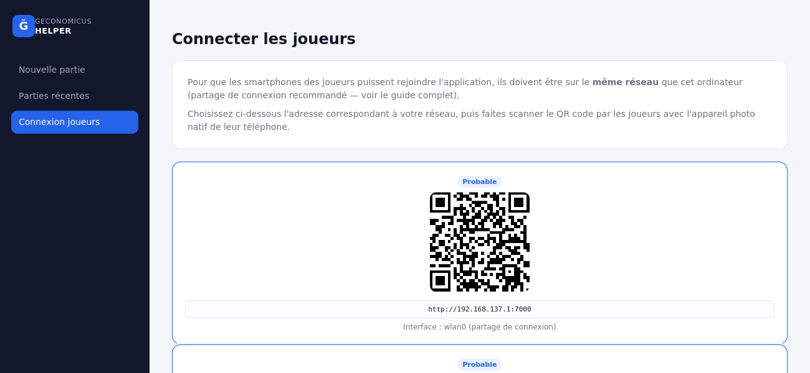

# Étape 3 — Connectivité (Phase A)

Ce document explique comment connecter les smartphones des joueurs à l'ordinateur
de l'animateur, et pourquoi ce choix technique a été fait.

## L'insight qui simplifie tout : deux caméras différentes, deux contraintes différentes

1. **Rejoindre la partie** (scanner le QR de l'écran "Connexion joueurs") : le
   joueur utilise l'**appareil photo natif** de son téléphone, qui reconnaît un QR
   code et propose d'ouvrir le lien. Ça fonctionne **en simple HTTP, sans aucune
   contrainte** — la limite de sécurité des navigateurs ne s'applique qu'à une
   page web qui demande elle-même l'accès à la caméra.
2. **Acheter une carte à un autre joueur** (étape 3, Phase C — pas encore
   implémentée) : là, c'est notre propre application web qui devra accéder à la
   caméra (`getUserMedia`), ce qui **nécessite HTTPS**. Cette fonctionnalité aura
   de toute façon un repli par saisie manuelle du code (déjà présent dans la
   maquette de référence).

**Conséquence** : la Phase A (connectivité de base, rejoindre la partie) ne
nécessite aucun certificat HTTPS. Le sujet HTTPS n'est à traiter que plus tard,
pour la Phase C, et seulement si on veut le scan QR en plus de la saisie
manuelle.

## Comparatif des options réseau

| | Wifi local du lieu | Partage de connexion (PC) | Bluetooth |
|---|---|---|---|
| Fiabilité | ⚠️ Risque d'isolation client (AP isolation) — fréquent sur les réseaux publics/invités, empêche les appareils connectés de se parler entre eux | ✅ Vous contrôlez tout, aucune dépendance au lieu | ❌ Inadapté (connexion 1-à-1, débit faible, appairage fastidieux à plusieurs) |
| Portabilité | Dépend du lieu | Fonctionne partout | — |
| Recommandation | Repli, si vous savez le réseau fiable | **Par défaut** | Écarté |

## Comment activer le partage de connexion, par système

### 🐧 Linux (scriptable)

Avec NetworkManager (présent sur la plupart des distributions de bureau) :
```bash
nmcli device wifi hotspot ifname wlan0 ssid GeconomicusParty password unmotdepasse
```
Automatisable dans `run.sh` si besoin (à ajouter dans une prochaine itération).

### 🍎 macOS (manuel)

Réglages Système → Partage → Partage internet. Partagez votre connexion (Ethernet
ou autre) via Wifi, donnez un nom de réseau et un mot de passe, puis activez.
Pas d'API en ligne de commande fiable fournie par Apple pour ça : un script qui
tenterait de l'automatiser serait fragile et risqué à exécuter sans pouvoir le
tester dans mon environnement — un guide manuel est plus sûr.

### 🪟 Windows (manuel)

Paramètres → Réseau et Internet → Point d'accès mobile. Activez, définissez le nom
du réseau et le mot de passe. Même remarque que macOS : pas d'automatisation
fiable proposée pour l'instant.

## Écran "Connexion joueurs"

Nouvel écran dans l'interface web (menu de gauche), qui :
1. détecte automatiquement les adresses IP locales de la machine
   (`NetworkUtils.java`, testé) ;
2. met en avant celles qui correspondent probablement à un réseau local/partage de
   connexion (badge "Probable") plutôt que de deviner à l'aveugle laquelle
   utiliser — l'IP exacte d'un point d'accès varie selon l'OS et l'outil
   (`192.168.137.1` pour le point d'accès mobile Windows, `10.42.0.1` pour
   NetworkManager sur Linux, `192.168.2.1` pour macOS, typiquement) ;
3. génère un QR code par adresse (bibliothèque `qrcodejs`, chargée en CDN comme
   Chart.js), à faire scanner par les joueurs.



**Vérifié** : la détection d'adresses IP a été testée réellement (pas seulement
compilée) dans l'environnement de préparation. Le QR code généré a été décodé
programmatiquement (bibliothèque `pyzbar`) pour confirmer qu'il pointe bien vers
la bonne URL.

## Ce qui n'est pas encore fait (Phases B/C suivantes)

- ~~L'écran affiche pour l'instant un QR vers la page d'accueil générale du serveur,
  pas encore vers un flux d'inscription joueur spécifique à une partie~~ **Fait en
  Phase B**, voir `docs/06-etape3-inscription-avatar.md`.
- Aucune automatisation du partage de connexion n'est encore intégrée à `run.sh`
  (Linux serait faisable ; macOS/Windows resteront probablement manuels).
- HTTPS, nécessaire uniquement pour le scan QR d'achat de cartes (Phase C), n'a
  pas été abordé — la saisie manuelle du code reste le mécanisme principal prévu
  pour cette fonctionnalité.
